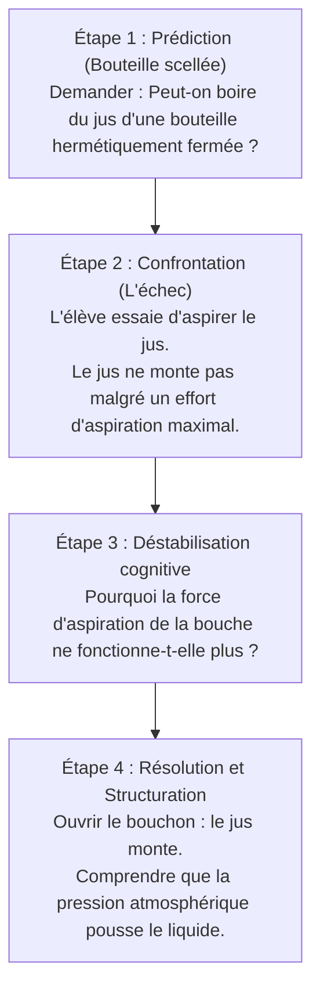

# Corrigé Détaillé de l'Examen Blanc de Sortie
## Épreuve : Évaluation des Compétences Professionnelles (Didactique de la Physique-Chimie)
### Thème : La Pression et la Pression Atmosphérique (1ère ASC)

---

## PARTIE I : Planification des apprentissages (24 pts)

### Question a : Analyse des compétences cibles (4 pts)

Le thème « Pression et pression atmosphérique » permet de développer des compétences clés du curriculum du secondaire collégial marocain.

1. **Compétence disciplinaire (الكفاية النوعية)** :
   * **Exemple** : *« Résoudre des situations-problèmes relatives aux propriétés physiques des gaz (pression, volume, compressibilité) en mobilisant les concepts scientifiques, la démarche expérimentale et les instruments de mesure appropriés (manomètre, seringue). »*
   * **Contribution du programme** : À travers l'étude de ce thème, l'élève apprend à manipuler des dispositifs étanches (seringue raccordée à un manomètre), à lire des échelles d'appareils de mesure (en $\text{hPa}$ ou $\text{bar}$) et à formuler une relation qualitative entre la variation de volume d'un gaz et sa pression. Il passe d'une observation naïve à une démarche expérimentale rigoureuse.

2. **Compétence transversale (الكفاية المستعرضة / الممتدة)** :
   * **Exemple** : *« Modéliser des phénomènes physiques invisibles et développer la pensée logique/abstraite. »*
   * **Contribution du programme** : La pression d'un gaz est un concept abstrait car l'air est invisible. L'étude de ce thème permet à l'élève d'utiliser le **modèle moléculaire** (représentation des molécules sous forme de particules en mouvement et en collision permanente) pour expliquer macroscopiquement les variations de pression. Ce passage du macroscopique (la résistance mécanique du piston) au microscopique (les chocs moléculaires) développe l'esprit scientifique et les capacités de modélisation.

---

### Question b : Seringue réelle vs Simulation moléculaire numérique (2 pts)

L'utilisation combinée du matériel réel et du numérique permet d'équilibrer l'acquisition de savoir-faire pratiques et conceptuels.

| Aspect évalué | Approche 1 : Manipulation réelle (Seringue + Manomètre) | Approche 2 : Simulation numérique interactive |
| :--- | :--- | :--- |
| **Construction des concepts** | • Offre une perception sensorielle directe : l'élève **ressent** la résistance de l'air comprimé. • Ancre le phénomène dans la réalité physique concrète. | • Permet de **visualiser** les molécules de gaz invisibles à l'œil nu. • Fait le lien direct entre la diminution du volume et l'augmentation de la fréquence des chocs moléculaires sur les parois (cause microscopique de la pression). |
| **Développement des habiletés expérimentales** | • Développe la motricité fine : pousser/tirer le piston lentement, assurer l'étanchéité des raccords. • Apprend à lire un instrument réel (erreur de parallaxe). | • Ne développe pas d'habileté manuelle motrice. • Permet d'isoler des variables virtuellement (ex : maintenir la température constante ou la faire varier pour observer son impact). |

> [!TIP]
> **Recommandation didactique** : Commencer par la manipulation réelle de la seringue pour faire émerger le phénomène, puis utiliser la simulation numérique comme outil d'explication microscopique (modélisation).

---

### Question c : Avantages de la planification à court terme (3 pts)

La planification de la séance sur la pression atmosphérique apporte trois avantages majeurs :
1. **Gestion optimisée du temps didactique (تدبير الغلاف الزمني)** : Elle permet de planifier l'enchaînement des étapes de la démarche d'investigation (situation problème, hypothèses, expérience de la bouteille écrasée, structuration) sur les 2 heures sans être débordé.
2. **Organisation rationnelle du milieu expérimental** : Prévoir à l'avance les bouteilles souples, le système de chauffage de l'eau, et les mesures de sécurité pour éviter les brûlures lors de la manipulation de l'eau bouillante.
3. **Préparation didactique face aux obstacles des élèves** : Anticiper la conception erronée tenace selon laquelle « le vide aspire la bouteille » et préparer des questions d'étayage guidant les élèves vers le rôle passif du vide et actif de la pression extérieure.

---

### Question d : Situation de départ et Fiche pédagogique détaillée (15 pts)

#### 1. Situation de départ problématique (3 pts) :
> **Situation : "Le mystère du jus d'orange bloqué"**
> Lors d'un goûter, Youssouf boit du jus d'orange dans un verre en utilisant une paille. Il remarque que le liquide monte facilement dès qu'il aspire. Intrigué, il décide de faire une expérience : il prend une bouteille en verre pleine de jus, ferme hermétiquement le goulot tout autour de la paille avec de la pâte à modeler (pâte plastique étanche) pour empêcher l'air extérieur d'entrer. À sa grande surprise, il a beau aspirer de toutes ses forces, le jus refuse de monter dans la paille. Dès qu'il retire la pâte à modeler, le jus remonte normalement.
>
> **Problématique formulée avec les élèves** : *Pourquoi le jus monte-t-il dans la paille dans une bouteille ouverte, mais refuse-t-il de monter lorsque la bouteille est fermée hermétiquement ? Quel est le rôle de l'air extérieur dans ce phénomène ?*

#### 2. Fiche pédagogique détaillée de la séquence (12 pts) :

* **Niveau** : 1ère ASC  |  **Unité** : Matière et environnement
* **Durée** : 2 heures (120 minutes)  |  **Effectif** : 30 élèves (6 groupes de 5)

---

### Déroulement de la séquence de 2 heures

| Étape & Durée | Objectifs opérationnels | Activités de l'enseignant (Rôle : Guide / Facilitateur) | Activités des apprenants (Rôle : Actif / Collaboratif) | Supports & Matériel | Évaluation & Régulation |
| :--- | :--- | :--- | :--- | :--- | :--- |
| **1. Situation de départ et Formulation du problème** *(15 min)* | • S'approprier la situation-problème. • Identifier le paradoxe de la bouteille fermée. | • Présente la situation de Youssouf (jus d'orange scellé) à l'aide du matériel réel (bouteille + paille + pâte à modeler). • Pose la question : *« Pourquoi l'aspiration seule ne suffit-elle pas à faire monter le jus ? »* | • Observent la démonstration et tentent d'aspirer le jus de la bouteille scellée. • Constatent l'échec de l'aspiration. • **Hypothèses** : « Il faut que l'air entre pour pousser le jus », « La bouteille fermée bloque l'aspiration », etc. | • Bouteilles, pailles. • Pâte à modeler. • Jus d'orange. | • Évaluation diagnostique : Vérifier si les notions d'air et de gaz sont acquises. |
| **2. Phase d'investigation : Éléments d'expérimentation** *(40 min)* | • Mettre en évidence l'existence de la pression de l'air extérieur (pression atmosphérique). | • Distribue le matériel aux 6 groupes. • Propose deux défis expérimentaux :   1. *Défi 1* : Remplir un verre d'eau à ras bord, poser une feuille de papier cartonné dessus, retourner le verre. Pourquoi l'eau ne coule-t-elle pas ?   2. *Défi 2* : Utiliser une ventouse sur une table lisse. Pourquoi est-elle difficile à décoller ? | • **En groupes de 5** :   *   Réalisent l'expérience du verre d'eau retourné.   *   Constatent que le papier ne tombe pas.   *   Expérimentent avec la ventouse.   *   Discutent au sein du groupe pour identifier la force qui pousse le papier vers le haut. | • Verres d'eau. • Papier cartonné. • Ventouses en plastique. | • Aide les groupes à bien retourner le verre sans introduire de bulles d'air. • Évalue la participation de tous les élèves. |
| **3. Mise en commun et Structuration (Fin de la séance 1)** *(20 min)* | • Définir la pression atmosphérique. • Connaître ses unités et son appareil de mesure. | • Recueille les explications des groupes au tableau. • Introduit la notion de **pression atmosphérique** comme la poussée exercée par l'air de l'atmosphère sur tous les corps. • Présente les unités (hPa, bar) et l'appareil de mesure (le **baromètre**). | • Rédigent la synthèse collective : l'air extérieur exerce une pression appelée pression atmosphérique. • Expliquent le mystère de la paille : l'air extérieur pousse sur le liquide dans le verre ouvert, ce qui le fait monter quand on aspire l'air dans la paille. | • Tableau. • Cahiers de cours. | • Évaluation formative : Demander aux élèves de justifier pourquoi les astronautes portent des combinaisons pressurisées. |
| **4. Approfondissement : Pression d'un gaz enfermé** *(30 min)* | • Comprendre le lien entre volume et pression d'un gaz. • Utiliser un manomètre. | • Distribue des seringues reliées à des manomètres. • Demande de pousser le piston (diminuer le volume) puis de le tirer (augmenter le volume) et de noter les valeurs de pression correspondantes. | • Réalisent les mesures de pression ($P$) pour différents volumes ($V$). • Remplissent un tableau de mesures. • Déduisent la loi qualitative de Boyle-Mariotte : la pression augmente quand le volume diminue. | • Seringues graduées. • Manomètres de démonstration. | • Régule les gestes de mesure (s'assurer de l'étanchéité du raccord seringue-manomètre). |
| **5. Synthèse finale et Évaluation sommative** *(15 min)* | • Valider la compréhension des concepts de pression et pression atmosphérique. | • Synthétise la loi qualitative de Boyle-Mariotte. • Distribue un exercice d'évaluation sommative. | • Notent la relation qualitative entre pression et volume. • Résolvent individuellement l'exercice proposé. | • Fiche d'exercices. | • Corrige les exercices et apporte un soutien immédiat aux élèves en difficulté. |

---

## PARTIE II : Gestion des apprentissages (18 pts)

### Question a : L'Enseignement Centré sur l'Apprenant (ECA) (4 pts)

#### 1. Gestion de la séance expérimentale de mesure de la pression (2.5 pts) :
Pour assurer l'ECA lors de cette manipulation :
* **Autonomie de l'investigation** : L'enseignant ne réalise pas l'expérience au tableau. Chaque groupe dispose d'une seringue et d'un manomètre. Les élèves décident eux-mêmes des valeurs de volume à tester (ex : $10\text{ mL}$, $15\text{ mL}$, $20\text{ mL}$) et reportent les pressions.
* **Coopération structurée** : Les élèves travaillent en rôles tournants (un manipulateur du piston, un lecteur du manomètre, un secrétaire notant les valeurs).
* **Questionnement ouvert** : L'enseignant guide en posant des questions réflexives : *« Que se passe-t-il sur le manomètre quand vous réduisez de moitié l'espace de l'air ? »* plutôt que de dire *« La pression double »*.

#### 2. Trois rôles majeurs de l'enseignant (1.5 pts) :
* **Médiateur didactique** : Il conçoit le milieu matériel (matériel étanche) et organise la confrontation des résultats entre les groupes.
* **Régulateur technique et cognitif** : Il passe de groupe en groupe pour rectifier les gestes expérimentaux erronés et poser des questions d'étayage lorsqu'un groupe est bloqué.
* **Animateur du débat scientifique** : Il orchestre la mise en commun finale pour aider les élèves à formuler eux-mêmes la conclusion de la loi.

---

### Question b : Analyse de la transcription (Support 3) (8 pts)

#### 1. Deux anomalies didactiques ou pédagogiques dans la gestion (2 pts) :
* **Magistralisme et dogmatisme (Fermeture précoce du débat)** : L'enseignant rejette rapidement les conceptions des élèves C et D (*« Non, réfléchissez »*) sans chercher à comprendre leur logique ni à les mettre à l'épreuve. Il impose directement son explication scientifique théorique et demande de la copier passivement dans les cahiers, ce qui stoppe toute démarche d'investigation active.
* **Démonstration purement frontale** : L'enseignant réalise la manipulation seul au bureau. Les élèves observent à distance de manière passive, favorisant un apprentissage par réception plutôt que par construction.

#### 2. Analyse de la représentation de l'élève C et pistes de guidage (6 pts) :

##### Analyse de la conception (« L'aspiration / La force du vide ») :
L'élève C associe le vide à une entité active dotée d'une force attractive (*« Le vide aspire la bouteille »*). Il s'agit d'un obstacle épistémologique historique hérité de la conception d'Aristote (*« l'horreur du vide »*). L'élève perçoit le vide intérieur comme une cause active (traction) au lieu de comprendre que le vide est passif (absence de matière) et que c'est la pression de l'air extérieur (la poussée) qui écrase la bouteille.

##### Pistes de guidage pour surmonter l'obstacle (sans donner la solution) :
1. **Déstabiliser la conception par une question-défi** :
   * Enseignant : *« Si le vide à l'intérieur aspire la bouteille et l'écrase, qu'arriverait-il si nous placions cette bouteille fermée dans un espace où il n'y a pas d'air du tout à l'extérieur (dans une cloche à vide) ? La bouteille va-t-elle s'écraser encore plus ? »*
2. **Réaliser l'expérience de confrontation (Cloche à vide)** :
   * L'enseignant place la bouteille déformée sous une cloche à vide et commence à aspirer l'air de la cloche. La bouteille reprend sa forme d'origine !
3. **Guider l'analyse de l'expérience** :
   * Enseignant : *« Que s'est-il passé quand nous avons retiré l'air qui entourait la bouteille ? Pourquoi ne s'écrase-t-elle plus ? »*
   * L'élève déduit de lui-même que l'air extérieur exerçait une poussée nécessaire pour écraser la bouteille.

---

### Question c : Hétérogénéité des mesures de Boyle-Mariotte (6 pts)

#### 1. Trois causes probables de la dispersion des mesures (3 pts) :
* **Fuite d'air (étanchéité défectueuse)** : Si la connexion entre la seringue et le manomètre n'est pas parfaitement étanche, de l'air s'échappe lors de la compression. La pression lue sera inférieure à la valeur théorique.
* **Non-respect de l'isothermie (effet thermique)** : La loi de Boyle-Mariotte n'est valable qu'à température constante ($T = \text{cte}$). Une compression trop rapide du piston échauffe le gaz, augmentant artificiellement sa pression.
* **Erreur de mesure systématique (Volume mort)** : Les élèves peuvent oublier de prendre en compte le volume de l'air contenu dans le tuyau de raccordement reliant la seringue au manomètre, faussant le produit $P \times V$.

#### 2. Solutions pour y remédier en classe (3 pts) :
* **Standardisation de la manipulation** : L'enseignant montre comment vérifier l'étanchéité (le piston doit revenir à sa place si on le relâche après une compression) et impose une compression très lente en attendant quelques secondes avant de lire le manomètre (stabilisation thermique).
* **Mise en commun avec outil informatique** : Entrer les mesures de tous les groupes dans un tableur (Excel/GeoGebra) au tableau. Tracer la courbe de régression $P = f(1/V)$ pour montrer qu'en dépit des erreurs de mesure individuelles, tous les points s'alignent sur une droite, confirmant la loi générale de proportionnalité inverse.
* **Introduction de la notion d'erreur expérimentale** : Expliquer aux élèves qu'en physique, une mesure comporte toujours des incertitudes inhérentes aux instruments et aux manipulations, et que l'important est la tendance globale.

---

## PARTIE III : Évaluation des apprentissages et Remédiation (18 pts)

### Question a : Outils d'évaluation (8 pts)

#### 1. Trois critères de qualité d'un outil d'évaluation (3 pts) :
* **Validité (الصدقية)** : L'évaluation teste exactement les objectifs de la leçon (ex : mesurer la pression d'un gaz) et non d'autres compétences (comme l'orthographe ou la vitesse d'écriture).
* **Fidélité (الثبات)** : L'outil doit donner les mêmes résultats quel que soit le correcteur ou si le test est passé à des moments différents dans des conditions similaires.
* **Discrimination (القدرة التمييزية)** : L'outil doit comporter des questions de difficultés graduées pour différencier les élèves ayant acquis la compétence de ceux ayant des lacunes.

#### 2. Élaboration d'items d'évaluation (5 pts) :

##### Objectif 1 : Connaître les unités de pression et savoir utiliser la relation qualitative entre volume et pression.
* **Item à réponse choisie (QCM)** :
  > L'unité internationale de mesure de la pression est :
  > □ A) Le Bar (bar)
  > □ B) Le Pascal (Pa)
  > □ C) Le Millilitre (mL)
  > □ D) Le Degré Celsius (°C)
  > *(Réponse attendue : B)*
* **Item à réponse construite (Question ouverte courte)** :
  > Un ballon de football souple contient un volume d'air $V_1$ sous une pression $P_1$. On appuie fortement sur le ballon avec les mains.
  > 1. Comment varie le volume $V_2$ de l'air à l'intérieur du ballon ?
  > 2. Comment varie sa pression $P_2$ ? Justifie ta réponse en utilisant le modèle moléculaire (mouvement des molécules d'air).

##### Objectif 2 : Expliquer l'existence de la pression atmosphérique à travers un phénomène du quotidien.
* **Item à réponse choisie (Association / Vrai-Faux)** :
  > Réponds par Vrai ou Faux :
  > *   La pression atmosphérique est due aux chocs des molécules de l'air de l'atmosphère sur les corps. (Vrai)
  > *   Si on enlève tout l'air d'une pièce, la pression atmosphérique augmente. (Faux)
* **Item à réponse construite (Question ouverte)** :
  > Une ventouse de cintre est pressée contre un carrelage mural lisse. Elle reste fixée solidement au mur et permet d'y suspendre une serviette.
  > Explique comment l'air extérieur permet à la ventouse de rester fixée sur le carrelage.

---

### Question b : Niveaux d'habileté (Note 193) (3.5 pts)

#### 1. Différence des niveaux d'habileté (1.5 pts) :
* **Niveau 1 : Restitution simple** : Demande le rappel de connaissances stockées en mémoire (définition de la pression atmosphérique, conversion directe d'unités).
* **Niveau 2 : Application** : Demande le transfert de ces notions dans une situation concrète nouvelle. L'élève doit analyser un schéma d'expérience, identifier les variables en jeu (masse, volume, pression) et appliquer la relation qualitative ou quantitative pour en déduire un résultat.

#### 2. Exemple d'item de niveau « Application » (2 pts) :
> **Exercice : Le problème du piston bloqué**
> Un cylindre étanche fermé par un piston contient de l'air à une pression initiale $P_1 = 1000\text{ hPa}$ dans un volume $V_1 = 100\text{ cm}^3$.
> On tire sur le piston pour doubler le volume ($V_2 = 200\text{ cm}^3$).
> 1. Calcule la nouvelle valeur de la pression $P_2$ en admettant que le produit $P \times V$ reste constant.
> 2. Indique si le piston est désormais plus facile ou plus difficile à tirer si on continue de l'éloigner. Justifie en comparant $P_2$ à la pression atmosphérique normale ($1013\text{ hPa}$).

---

### Question c : Traitement de la conception « L'aspiration comme force active » (6.5 pts)

#### 1. Origine de la conception erronée :
Cette représentation trouve son origine dans l'**expérience sensorielle quotidienne et anthropocentrique** de l'enfant. L'acte d'aspirer demande un effort physique (contraction des muscles thoraciques). L'élève associe cet effort à une "force attractive" générée par sa bouche qui tire activement le liquide vers le haut. Il ignore la présence invisible de l'air extérieur qui appuie sur la surface libre du liquide pour le pousser dans la paille.

#### 2. Séquence de remédiation par conflit cognitif :

##### Étape 1 : Émergence et Prédiction
* **Dispositif** : Une paille est insérée dans une bouteille de jus d'orange à travers un bouchon percé. L'étanchéité autour de la paille et du bouchon est scellée hermétiquement avec de la pâte à modeler.
* **Question** : *« Si j'aspire le jus par la paille, va-t-il monter dans ma bouche ? »*
* **Prédiction des élèves** : La majorité répond que oui, car ils croient que la force de leur bouche suffit à tirer le liquide.

##### Étape 2 : Confrontation (Création du conflit)
* **Action** : Un élève tente d'aspirer le jus devant la classe.
* **Observation** : Le jus ne monte pas. L'élève s'essouffle rapidement sans résultat.
* **Le Conflit** : Pourquoi le jus ne monte-t-il pas alors que la force d'aspiration de l'élève est bien réelle et identique à d'habitude ? Son modèle mental basé sur l'aspiration active est mis en échec.

##### Étape 3 : Résolution didactique
* **Action** : L'enseignant fait un petit trou dans la pâte à modeler pour laisser entrer l'air de la pièce dans la bouteille. L'élève aspire à nouveau : le jus monte instantanément.
* **Structuration** : L'enseignant guide la verbalisation : *« L'air de la pièce est entré par le trou et a appuyé sur la surface du jus. C'est cet air qui a poussé le jus dans la paille. L'aspiration sert uniquement à enlever l'air à l'intérieur de la paille pour créer une différence de pression. C'est la pression atmosphérique extérieure qui fait tout le travail mécanique en poussant le liquide. »*
