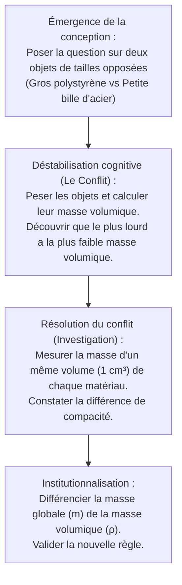

# Corrigé Détaillé de l'Examen de Sortie CRMEF 2025
## Épreuve : Évaluation des Compétences Professionnelles (Didactique de la Physique-Chimie)
### Filière : Qualification des Enseignants du Secondaire Collégial (1ère Année)

---

## PARTIE I : Planification des apprentissages (24 pts)

### Question a : Analyse des compétences cibles (4 pts)

Les *Programmes et Orientations Pédagogiques de Physique-Chimie* visent le développement de compétences harmonieuses chez l'apprenant au collège.

1. **Compétence disciplinaire (الكفاية النوعية)** :
   * **Exemple** : *« Résoudre des situations-problèmes relatives à la matière, ses propriétés physiques et ses transformations, en mobilisant les concepts, lois et démarches de la physique-chimie. »* (حل وضعيات مشكلة تتعلق بالمادة وخواصها الفيزيائية وتحولاتها...).
   * **Contribution du programme** : Le programme de la 1ère année collège (unité *« Matière et environnement »*) fournit les concepts de base nécessaires à la modélisation de la matière (états physiques, volume, masse, modèle moléculaire, mélanges). L'apprenant apprend à utiliser des instruments de mesure (balance, éprouvette) pour caractériser des échantillons et à relier des observations macroscopiques (ex: compressibilité d'un gaz, solubilité) à des structures microscopiques (modèle moléculaire). Cette mobilisation progressive de concepts scientifiques permet de structurer une pensée rigoureuse face à des situations concrètes.

2. **Compétence transversale (الكفاية المستعرضة / الممتدة)** :
   * **Exemple** : *« Adopter des comportements éco-responsables et citoyens vis-à-vis des ressources naturelles et de l'environnement. »* (اتخاذ مواقف مسؤولة تجاه البيئة والموارد الطبيعية).
   * **Contribution du programme** : À travers l'étude du cycle de l'eau, du traitement des eaux polluées et des mélanges, le programme amène l'élève à prendre conscience de la rareté de l'eau et de l'impact des activités humaines sur l'environnement. La discipline n'apporte pas seulement des connaissances théoriques, mais éveille le sens de la responsabilité civique de l'élève en l'incitant à économiser l'eau et à respecter son milieu écologique.

---

### Question b : Impact de l'apprentissage numérique sur l'expérimentation (2 pts)

L'intégration des technologies de l'information et de la communication pour l'enseignement (TICE) a un impact différencié sur la construction des savoirs et les habilletés expérimentales.

| Aspect évalué | Apport des simulations numériques (Simulations) | Limites et besoin de manipulations réelles (Manipulations) |
| :--- | :--- | :--- |
| **Construction des apprentissages** | • Permet de modéliser et visualiser l'invisible (mouvement des molécules, liaisons chimiques). • Facilite la répétabilité des expériences sans risque ni coût de consommables. • Favorise l'apprentissage par essai-erreur dans un environnement sécurisé. | • La simulation présente un modèle idéal sans incertitude. • Peut créer l'illusion que la science fonctionne de manière parfaite sans marge d'erreur. • Risque de déconnexion avec la réalité matérielle si elle n'est pas contextualisée. |
| **Développement des habilletés expérimentales** | • Familiarise l'élève avec les étapes d'un protocole et la silhouette du matériel. • Permet l'entraînement virtuel aux techniques de mesure (ex : lecture sur une balance). | • Ne développe pas la motricité fine ni la dextérité manuelle (manipuler de la verrerie, verser un liquide). • N'apprend pas à gérer les imprévus matériels réels (fuites, pannes de balance, erreurs physiques de parallaxe). |

> [!NOTE]
> **Conclusion didactique** : Les simulations ne doivent pas remplacer les manipulations réelles. Elles doivent intervenir en complément (en amont pour préparer, ou en aval pour modéliser à l'échelle microscopique).

---

### Question c : Avantages de la planification à court terme (3 pts)

La planification à court terme (élaboration de la fiche pédagogique d'une leçon ou séance) est essentielle pour l'enseignant pour trois raisons :
1. **Régulation du temps didactique (تدبير الزمن المدرسي)** : Elle permet de structurer les étapes de la leçon (introduction, recherche, synthèse, évaluation) et d'y allouer des durées réalistes, évitant ainsi l'improvisation et le non-achèvement du programme.
2. **Rationalisation des choix didactiques (عقلنة الموارد والوسائل)** : Elle force l'enseignant à définir précisément les objectifs opérationnels, à anticiper les prérequis requis (volume, masse) et à préparer le matériel expérimental adapté aux 30 élèves.
3. **Anticipation des obstacles cognitifs (توقع العوائق والصعوبات)** : Elle permet de recenser à l'avance les représentations erronées fréquentes chez les élèves (comme la confusion entre "lourd" et "dense") et de concevoir des dispositifs d'étayage et de différenciation pédagogique appropriés.

---

### Question d : Situation de départ pour la leçon "Masse volumique" (3 pts)

#### 1. Caractéristiques d'une situation de départ en démarche d'investigation :
* **Créatrice de conflit cognitif (محدثة لصراع معرفي)** : Elle doit bousculer les conceptions initiales des élèves et poser un problème qu'ils ne peuvent pas résoudre directement avec leurs connaissances actuelles.
* **Contextualisée et signifiante (سياقية وذات معنى)** : Elle doit être ancrée dans le réel, la vie quotidienne ou l'environnement de l'apprenant pour susciter sa curiosité.
* **Ouverte mais orientée (مستفزة وموجهة)** : Elle permet la formulation d'hypothèses variées et vérifiables expérimentalement par les élèves, sans être trop complexe ou hors de portée.

#### 2. Proposition de situation de départ (basée sur le Support 2) :
> **Contexte** : Lors d'une visite au lac de Bin-Elouidane, vous observez un pêcheur. Pour maintenir son filet vertical sous l'eau, il attache des flotteurs légers en plastique en haut du filet, et des lests (poids) en plomb en bas. 
> Deux métaux d'apparence grise identique, le plomb et l'aluminium, sont disponibles au laboratoire. Pour remplacer le plomb (toxique), un élève propose d'utiliser des cylindres d'aluminium de même volume. Un autre affirme que l'aluminium ne coulera pas aussi efficacement car, pour un même volume, l'aluminium est « plus léger » que le plomb.
>
> **Problématique posée à la classe** : *Comment deux objets métalliques de même volume (plomb et aluminium) peuvent-ils avoir des masses différentes ? Quelle grandeur physique permet de caractériser chaque matière indépendamment de sa forme et de sa taille ?*

---

### Fiche Pédagogique Détaillée : La Masse Volumique (12 pts)

* **Niveau** : 1ère année du cycle secondaire collégial
* **Unité** : Matière et environnement
* **Durée** : 2 heures (120 minutes répartie en 2 séances de 60 min)
* **Effectif** : 30 élèves (répartis en 6 groupes de 5 élèves)

#### Prérequis :
* Mesure du volume d'un liquide et d'un solide irrégulier (éprouvette graduée).
* Mesure de la masse d'un solide et d'un liquide (balance électronique, fonction Tare).

#### Objectifs d'apprentissage :
* Découvrir la notion de masse volumique d'une substance.
* Connaître et exploiter la relation $\rho = \frac{m}{V}$ et ses unités ($\text{g/cm}^3$, $\text{kg/m}^3$).
* Déterminer expérimentalement la masse volumique d'un solide et d'un liquide.
* Utiliser la masse volumique pour identifier une substance ou expliquer sa flottabilité.

---

### Déroulement de la séquence (Fiche de préparation)

| Étape & Durée | Objectifs opérationnels | Activités de l'enseignant (Rôle : Guide / Facilitateur) | Activités des apprenants (Rôle : Actif / Collaboratif) | Supports & Matériel | Évaluation & Régulation |
| :--- | :--- | :--- | :--- | :--- | :--- |
| **1. Situation de départ et Problématique** *(15 min)* | • S'approprier le problème. • Émettre des hypothèses. | • Présente la situation du pêcheur du lac de Bin-Elouidane (Support 2) à l'aide d'illustrations. • Pose la question : *« Pourquoi des objets de même volume ont-ils des masses différentes ? »* | • Lisent la situation et observent les documents. • Conduisent une réflexion individuelle puis collective. • **Hypothèses formulées** : « Le plomb contient plus de matière », « Chaque métal a sa propre lourdeur », etc. | • Support 2 (extrait de manuel). • Cylindres de plomb, cuivre, aluminium. | • Évaluation diagnostique des prérequis sur la masse et le volume. |
| **2. Investigation expérimentale (Solides)** *(30 min)* | • Concevoir et réaliser un protocole pour mesurer $m$ et $V$. • Calculer le rapport $m/V$. | • Distribue le matériel aux 6 groupes. • Demande aux groupes de mesurer la masse $m$ et le volume $V$ de trois cylindres différents de même volume. • Circule pour guider la manipulation et s'assurer du respect des consignes de sécurité et de précision. | • **En groupe de 5** :   1. Pèsent chaque cylindre avec la balance électronique ($m$).   2. Mesurent le volume de chaque cylindre par déplacement de liquide dans l'éprouvette ($V$).   3. Remplissent le tableau de mesures.   4. Calculent le rapport $\frac{m}{V}$ pour chaque métal. | • Balances électroniques. • Éprouvettes graduées. • Cylindres (Al, Cu, Pb). • Eau. | • Régule les gestes de mesure (lecture du ménisque, réglage de la balance). • Vérifie la répartition des rôles dans les groupes. |
| **3. Confrontation et Structuration (Séance 1)** *(15 min)* | • Conclure que $\frac{m}{V}$ est une constante propre à chaque matériau. | • Invite les porte-paroles à noter leurs résultats au tableau. • Oriente la discussion vers le constat : pour un même métal, le rapport $m/V$ reste constant, mais il diffère d'un métal à l'autre. • Définit la **masse volumique** $\rho$. | • Comparent les résultats des différents groupes. • Constatent la constance du rapport $\frac{m}{V}$ pour chaque type de métal. • Écrivent la formule générale : $\rho = \frac{m}{V}$ et notent l'unité usuelle ($\text{g/cm}^3$). | • Tableau de synthèse collectif. • Cahier de cours. | • Évaluation formative : Demander de calculer la masse volumique d'un solide de masse $54\text{ g}$ et de volume $20\text{ cm}^3$. |
| **4. Rappel et Investigation (Liquides)** *(25 min)* | • Déterminer expérimentalement la masse volumique d'un liquide. | • Lance un nouveau défi : *« Comment mesurer la masse volumique de l'eau et de l'huile pour savoir pourquoi l'huile flotte sur l'eau ? »* • Demande de mesurer $m$ de différents volumes d'eau et d'huile. | • Conçoivent le protocole pour un liquide (pesée du récipient vide puis plein, ou utilisation de la Tare). • Réalisent les mesures pour $50\text{ mL}$ et $100\text{ mL}$ d'eau et d'huile. • Calculent les rapports $\rho_{\text{eau}}$ et $\rho_{\text{huile}}$. | • Éprouvettes graduées. • Eau, huile. • Balances électroniques. | • S'assure que la fonction Tare de la balance is maîtrisée. • Aide à la gestion des gouttes d'eau sur la balance. |
| **5. Structuration finale et Généralisation** *(20 min)* | • Institutionnaliser le concept. • Relier la masse volumique à la flottabilité. | • Synthétise les valeurs obtenues : $\rho_{\text{eau}} \approx 1\text{ g/cm}^3$ et $\rho_{\text{huile}} \approx 0,9\text{ g/cm}^3$. • Explique la flottabilité en comparant les masses volumiques à celle de l'eau. | • Notent la synthèse : la masse volumique est une propriété physique caractéristique de la matière. • Établissent la règle : un corps flotte sur l'eau si sa masse volumique est inférieure à celle de l'eau. | • Cahiers. • Tableau. | • Interroger les élèves sur la flottabilité du liège ($\rho = 0,24\text{ g/cm}^3$) sur l'eau. |
| **6. Évaluation sommative et Remédiation** *(15 min)* | • Valider les acquis de la leçon. | • Propose un exercice d'application concret (identification d'un échantillon métallique inconnu). | • Résolvent individuellement l'exercice puis confrontent leurs démarches. | • Fiche d'exercices. | • Analyse des erreurs de calcul et conversion d'unités pour une remédiation ciblée. |

---

## PARTIE II : Gestion des apprentissages (18 pts)

### Question a : L'Enseignement Centré sur l'Apprenant (ECA) (4 pts)

L'ECA rompt avec le modèle transmissif traditionnel en plaçant l'élève au cœur du processus d'apprentissage.

#### 1. Deux avantages de l'ECA (2.5 pts) :
* **Développement de l'autonomie et de la métacognition** : L'apprenant construit activement ses savoirs (par investigation, manipulation et confrontation d'idées), ce qui favorise une compréhension profonde, durable et transférable à des situations nouvelles.
* **Accroissement de la motivation intrinsèque** : Le fait de travailler sur des situations contextualisées et d'être responsable de sa démarche expérimentale valorise l'élève et renforce son engagement dans la tâche.

#### 2. Trois tâches de l'enseignant dans le cadre de l'ECA :
* **Concepteur/Facilitateur** : Il prépare des situations d'apprentissage stimulantes (situations-problèmes) et organise le milieu didactique (mise à disposition du matériel expérimental nécessaire).
* **Médiateur/Animateur** : Il oriente la réflexion des élèves par un questionnement ouvert, encourage les interactions constructives et gère les dynamiques de groupe sans imposer de réponses.
* **Régulateur/Accompagnateur** : Il observe, identifie les obstacles et conceptions des élèves en temps réel pour leur apporter un étayage individualisé (différenciation).

#### 3. Comment assurer l'ECA en classe (1.5 pts) :
* Mettre en œuvre la **démarche d'investigation** où l'élève formule ses hypothèses et teste ses protocoles.
* Privilégier le **travail collaboratif en petits groupes** avec des rôles assignés (manipulateur, rapporteur, secrétaire) pour impliquer chaque élève.
* Limiter le temps d'exposition magistrale au profit du temps d'activité des élèves, en transformant la phase de cours en une mise en commun et structuration des résultats trouvés par les élèves.

---

### Question b : Analyse de la transcription de séance (Support 3) (8 pts)

#### 1. Identification de deux anomalies majeures dans la mise en œuvre (2 pts) :
* **Directivité précoce et inductivisme de l'enseignant** : Au lieu de laisser les élèves proposer des pistes pour chercher ce qui caractérise une matière, l'enseignant impose directement la formule mathématique à vérifier (*« conceviez un protocole expérimental précis pour vérifier si la masse divisée par le volume, ou la masse multipliée par le volume, etc., est une grandeur caractéristique »*). L'activité scientifique est réduite à un exercice arithmétique de vérification d'une formule parachutée.
* **Absence de régulation des dynamiques de groupe** :
  * *Dans le groupe 1* : L'élève A monopolise le pouvoir et dicte ses ordres, ignorant l'élève B, tandis que l'élève C est totalement passif et déconnecté du sens de l'activité.
  * *Dans le groupe 2* : Les élèves D et E se partagent mécaniquement le matériel (balance et éprouvette) sans concertation, ce qui mène à des erreurs graves. L'enseignant observe ces dérives sans intervenir pour restructurer la coopération au sein des groupes.

#### 2. Analyse didactique du silence/confusion des élèves et pistes de remédiation (6 pts) :

##### Causes possibles du silence et de la confusion :
1. **Défaut d'appropriation du problème (عدم تملك المشكل)** : Le concept de *masse volumique* a été introduit de manière nominale et abstraite par l'enseignant, sans que les élèves n'en ressentent le besoin fonctionnel. Ils réalisent une manipulation dont ils ne comprennent pas le but ni l'utilité réelle.
2. **Saut cognitif trop important** : L'enseignant passe brutalement de l'observation (*« des objets de même volume peuvent avoir des masses différentes »*) à l'abstraction pure (*« grandeur qui caractérise une substance »*) sans étape transitoire visant à faire manipuler des objets de volumes différents d'une même matière.
3. **Peur de l'erreur** : La question posée est trop ouverte et dénuée de cadre pragmatique, provoquant une insécurité cognitive chez les élèves qui préfèrent se taire.

##### Pistes de remédiation didactique :
1. **Ancrer la séance dans un problème concret (Défi d'identification)** : Proposer d'identifier le matériau d'un objet mystère peint (ex: s'agit-il d'argent ou d'aluminium ?). Les élèves comprendront d'eux-mêmes qu'il faut mesurer sa masse et son volume et chercher un rapport caractéristique pour comparer avec des valeurs connues.
2. **Pratiquer un étayage par étapes (Scaffolding)** : Poser des questions guidant la réflexion pas-à-pas : *« Si on prend un volume double d'eau, sa masse va-t-elle doubler ? Faisons la mesure. Quel rapport reste constant ? »*
3. **Structurer le travail de groupe** : Instaurer des contrats de rôle explicites au sein de chaque groupe de travail pour éviter la passivité ou l'autoritarisme.

---

### Question c : Problème de l'hétérogénéité des mesures (6 pts)

#### 1. Trois causes probables de l'hétérogénéité des mesures obtenues :
* **Erreur de parallaxe lors de la lecture du volume** : Relevée explicitement dans le Support 3 pour l'élève E (*« tente de lire le volume de l'eau dans l'éprouvette en regardant de biais, introduisant une erreur de parallaxe flagrante »*).
* **Erreur de protocole sur la pesée du liquide** : L'élève D pèse un bécher vide sans noter sa masse, ajoute de l'eau puis repèse, sans savoir comment extraire la masse de l'eau seule. L'absence d'utilisation correcte de la Tare ou de calcul de soustraction ($m_{\text{eau}} = m_{\text{total}} - m_{\text{bécher}}$) fausse totalement les résultats.
* **Imprécision instrumentale et conversion** : Des variations dues à des balances mal étalonnées d'un groupe à l'autre, ou des erreurs dans le calcul arithmétique de division (mauvaise gestion des chiffres après la virgule).

#### 2. Actions de l'enseignant pour y remédier :
* **Modélisation des gestes techniques (Démonstration préalable)** : L'enseignant doit effectuer une démonstration collective au bureau montrant :
  * Comment placer l'œil horizontalement, en face de la base du ménisque de l'éprouvette.
  * Comment tarer la balance avec le récipient vide avant d'y verser le liquide.
* **Fourniture d'une fiche-guide de protocole** : Distribuer une fiche consigne claire décrivant précisément les étapes de manipulation et de calcul sous forme d'algorithme simple.
* **Exploitation collective des mesures (Mise en commun)** : Reporter toutes les mesures des groupes dans un tableau à double entrée au tableau. Calculer la moyenne ou tracer la courbe $m = f(V)$ collectivement. Cela montrera que les erreurs individuelles se compensent et que la tendance linéaire met en évidence la constance du rapport $\frac{m}{V}$ pour chaque substance.

---

## PARTIE III : Évaluation et Remédiation (18 pts)

### Question a : Évaluation et qualité des outils (8 pts)

#### 1. Critères de qualité d'un outil d'évaluation (3 pts) :
* **Validité (الصدقية)** : L'outil évalue réellement ce qu'il est destiné à évaluer. Par exemple, si l'objectif est d'évaluer la compétence expérimentale, l'outil doit comporter des tâches de manipulation ou de description méthodologique, et non de simples questions de cours par coût.
* **Fidélité (الثبات)** : L'outil produit des résultats constants et reproductibles. Deux correcteurs différents attribuent la même note à la même copie, ou un élève obtient le même score si le test est répété dans les mêmes conditions.
* **Sensibilité / Discrimination (القدرة التمييزية)** : L'outil doit permettre de différencier les élèves selon leur niveau d'acquisition (présence de questions de difficultés progressives).

#### 2. Élaboration d'items d'évaluation (5 pts) :

##### Objectif 1 : Déterminer expérimentalement le volume d’un corps de forme irrégulière
* **Item à réponse choisie (QCM)** :
  > Une éprouvette graduée contient $40\text{ mL}$ d'eau. On y introduit une bille métallique de forme irrégulière. Le niveau de l'eau atteint désormais $58\text{ mL}$.
  > Quelle est la valeur du volume de la bille ?
  > □ A) $40\text{ cm}^3$  
  > □ B) $18\text{ cm}^3$  
  > □ C) $58\text{ cm}^3$  
  > □ D) $98\text{ cm}^3$  
  > *(Note : $1\text{ mL} = 1\text{ cm}^3$)*
* **Item à réponse construite (Question ouverte)** :
  > Rédige un protocole expérimental court (4 à 5 étapes) expliquant comment mesurer le volume d'un caillou à l'aide d'une éprouvette graduée contenant de l'eau et d'une balance. Accompagne ton texte d'un schéma légendé de l'expérience.

##### Objectif 2 : Distinguer entre le volume et la capacité
* **Item à réponse choisie (Appariement)** :
  > Relie par une flèche chaque concept à sa définition correcte :
  > *   **Le volume d'un corps** ──── A. La quantité maximale de liquide ou de gaz qu'un récipient peut contenir.
  > *   **La capacité d'un récipient** ── B. L'espace physique tridimensionnel occupé par un objet.
* **Item à réponse construite (Question de raisonnement)** :
  > Un bocal en verre épais a un volume extérieur de $800\text{ cm}^3$. Lorsqu'on le remplit d'eau à ras bord, il contient $500\text{ mL}$ d'eau.
  > Explique pourquoi la capacité du bocal est différente de son volume extérieur.

---

### Question b : Niveaux d'habileté (Note ministérielle 193) (3.5 pts)

#### 1. Différence entre les deux niveaux d'habileté :
* **Restitution et exploitation simple des ressources (Niveau 1)** : Évalue la capacité à restituer des connaissances brutes (formules, définitions, unités) ou à reproduire des tâches automatisées et familières (ex : recopier la formule de la masse volumique ou convertir $15\text{ g}$ en $\text{kg}$).
* **Application (Niveau 2)** : Évalue la capacité à mobiliser et transférer ses connaissances et savoir-faire dans une situation nouvelle ou modifiée pour résoudre un problème (ex : calculer la masse volumique d'un solide à partir de données expérimentales de masse et de volume, puis comparer avec des données tabulées pour identifier le métal).

#### 2. Exemple d'item de niveau "Application" en lien avec la leçon :
> **Exercice : L'énigme du métal perdu**
> Au laboratoire, Amine trouve un bloc de métal gris sans étiquette. Il veut savoir s'il s'agit de zinc ou de fer.
> 1. Il mesure la masse du bloc sur la balance et trouve $m = 142\text{ g}$.
> 2. Il l'introduit dans une éprouvette graduée contenant $100\text{ mL}$ d'eau. Le niveau de l'eau monte à $120\text{ mL}$.
>
> **Questions :**
> A) Calcule la masse volumique $\rho$ de ce bloc métallique en $\text{g/cm}^3$ (sachant que $1\text{ mL} = 1\text{ cm}^3$). Écris toutes les étapes de ton calcul.
> B) En comparant ton résultat avec les données suivantes, identifie la nature du métal du bloc. Justifie ta réponse.
> *   Masse volumique du zinc : $\rho_{\text{Zinc}} = 7,1\text{ g/cm}^3$
> *   Masse volumique du fer : $\rho_{\text{Fer}} = 7,9\text{ g/cm}^3$

---

### Question c : Traitement de la conception erronée « Lourd = Plus dense » (6.5 pts)

#### 1. Origines probables de cette erreur :
* **Confusion entre grandeur extensive (masse) et grandeur intensive (masse volumique)** : L'élève a du mal à détacher la propriété de la matière de la quantité globale de l'objet. Pour lui, un gros objet (comme un tronc d'arbre) est "lourd", donc il doit couler ou avoir une densité supérieure à celle d'une petite bille d'acier qui est "légère".
* **Obstacle phénoménologique et sensoriel** : Le ressenti tactile du poids de l'objet influence le jugement de l'élève. Il n'intègre pas le rôle compensateur du volume occupé par l'objet.
* **Absence de distinction entre masse et comportement de flottabilité** : L'élève attribue la flottabilité uniquement à la masse absolue de l'objet (l'objet coule "parce qu'il est lourd", il flotte "parce qu'il est léger").

#### 2. Séquence de remédiation par conflit cognitif :

##### Étape 1 : Émergence et déstabilisation (Création du conflit cognitif)
* **Action** : L'enseignant montre à la classe un très grand bloc de polystyrène ($m = 200\text{ g}$) et une petite bille d'acier ($m = 30\text{ g}$).
* **Question posée** : *« Lequel a la plus grande masse volumique ? Lequel va flotter ou couler ? »*
* **Réponse majoritaire attendue** : Les élèves affirment que le bloc de polystyrène a la plus grande masse volumique car il est plus lourd globalement ($200\text{ g} > 30\text{ g}$).
* **Confrontation** : L'enseignant plonge les deux objets dans l'eau. Les élèves constatent avec surprise que le bloc de $200\text{ g}$ flotte, tandis que la petite bille de $30\text{ g}$ coule instantanément. Leur modèle explicatif basé sur la seule masse absolue s'effondre.

##### Étape 2 : Investigation et traitement
* **Action** : Les élèves mesurent le volume de chaque objet.
  * Pour la bille d'acier : $m_1 = 30\text{ g}$ ; $V_1 = 3,8\text{ cm}^3 \rightarrow \rho_1 \approx 7,9\text{ g/cm}^3$.
  * Pour le bloc de polystyrène : $m_2 = 200\text{ g}$ ; $V_2 = 10\ 000\text{ cm}^3 \rightarrow \rho_2 \approx 0,02\text{ g/cm}^3$.
* **Analyse** : Les élèves calculent la masse d'un seul centimètre cube de chaque matière (unité de volume commune). Ils réalisent que pour un même volume ($1\text{ cm}^3$), l'acier pèse $7,9\text{ g}$ alors que le polystyrène ne pèse que $0,02\text{ g}$.

##### Étape 3 : Institutionnalisation (Structuration)
* L'enseignant formalise la distinction : la masse globale $m$ dépend de la taille de l'objet, alors que la masse volumique $\rho$ est une caractéristique intrinsèque de la matière elle-même, indépendamment de sa quantité.
