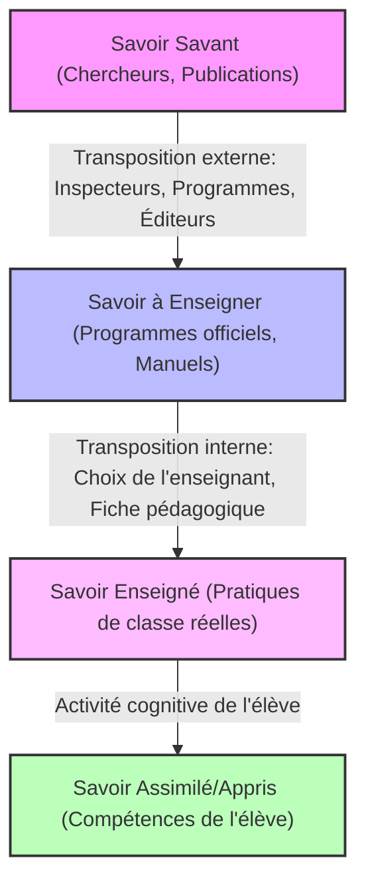
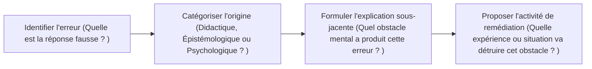

# Fiches de Révision Détaillées (Cheat Sheets) : Didactique de la Physique-Chimie
*Préparation intensive à l'examen de qualification professionnelle (CQP)*

---

## 📑 FICHE 1 : La Transposition Didactique & Le Contrat Didactique

### 1. Les Niveaux de la Transposition Didactique
La transposition didactique est l'adaptation du savoir pour le rendre enseignable. Elle comporte 4 niveaux clés :



*   **Exemple concret (La Réaction Chimique au Collège)** :
    *   *Savoir Savant* : Théorie des collisions moléculaires, thermodynamique et cinétique chimique.
    *   *Savoir à Enseigner* : Modélisation macroscopique (conservation des atomes en genre et en nombre) et microscopique simple (réarrangement d'atomes modélisés par des sphères colorées).
    *   *Savoir Enseigné* : L'enseignant réalise la combustion du méthane en TP, utilise des modèles moléculaires en plastique et écrit l'équation chimique équilibrée au tableau.
    *   *Savoir Assimilé* : L'élève est capable d'expliquer pourquoi la masse ne varie pas lors d'une réaction et d'équilibrer une équation de combustion simple.

### 2. Le Contrat Didactique et les Dérives (Effets Didactiques)
Le contrat didactique définit les attentes réciproques (souvent implicites) entre l'enseignant et les élèves concernant le savoir. 
Lorsqu'un enseignant tente d'éviter l'échec des élèves à tout prix, il peut provoquer des **dérives didactiques** :

| Effet Didactique | Définition théorique | Exemple concret en Physique-Chimie (Collège) |
| :--- | :--- | :--- |
| **L'Effet Topaze** | L'enseignant simplifie tellement la question ou donne des indices évidents que l'élève trouve la réponse sans faire l'effort intellectuel requis. | L'enseignant demande : *« Quelle est la formule de la loi d'Ohm ? Ça commence par U... U égale R fois... ? »* L'élève répond : *« I ! »* sans comprendre la relation physique. |
| **L'Effet Jourdain** | L'enseignant accepte une réponse banale, incomplète ou fausse de l'élève et la valorise comme s'il s'agissait d'un comportement scientifique génial. | Un élève dit : *« L'eau disparaît quand elle bout »*. L'enseignant s'extasie : *« Bravo, tu as compris le concept de vaporisation et le passage à l'état gazeux invisible ! »* alors que l'élève pense que l'eau a réellement été détruite. |
| **Le Glissement Métacognitif** | L'enseignant remplace l'objet d'apprentissage scientifique par l'outil ou le support méthodologique utilisé. | Passer toute la séance de physique à enseigner comment tracer un graphique sur ordinateur ou comment utiliser les couleurs sur Excel, au détriment de l'analyse physique de la courbe (ex: proportionnalité de la tension et de l'intensité). |
| **L'Usage Abusif de l'Analogie** | L'enseignant utilise une comparaison familière pour expliquer un concept physique complexe, mais l'analogie masque la réalité scientifique et crée de nouveaux obstacles. | Comparer le courant électrique à de l'eau circulant dans des tuyaux. Les élèves finissent par croire que l'électricité "s'écoule par terre" si le fil est coupé, ou que les fils contiennent de l'eau. |

---

## 📑 FICHE 2 : Les Représentations Typiques des Élèves au Collège

Les élèves n'arrivent pas en classe comme des "tables rases". Ils ont des théories intuitives (représentations) qui font obstacle au savoir scientifique.

### 1. En Électricité
*   **Modèle du Monopôle (Le courant à sens unique)** : L'élève pense qu'un seul fil reliant le pôle positif d'une pile à la lampe suffit pour l'allumer. Le second fil est perçu comme un simple "retour" inutile.
*   **Modèle du Courant Consommé (L'usure du courant)** : L'élève pense que le courant électrique part de la pile, traverse la première lampe (qui brille fort), s'affaiblit en y laissant de l'énergie, et ressort plus faible pour la deuxième lampe (qui brillera moins).
*   *Solution didactique* : Faire brancher deux lampes identiques en série et insérer deux ampèremètres (un avant et un après la première lampe) pour prouver expérimentalement que l'intensité du courant $I$ est la même en tout point d'un circuit en série (loi d'unicité de l'intensité).

### 2. En Mécanique
*   **Obstacle Aristotélicien (Mouvement = Force)** : L'élève croit que pour qu'un objet bouge, il faut obligatoirement qu'une force s'exerce sur lui en permanence dans le sens du mouvement (ex: si une bille roule sur le sol, l'élève pense qu'une force invisible continue de la pousser vers l'avant).
*   **Confusion Masse / Poids** : L'élève pense que le poids et la masse sont identiques, ou que le poids se mesure en kilogrammes. Il ne conçoit pas le poids comme une action mécanique à distance (force d'attraction gravitationnelle).
*   *Solution didactique* : Utiliser le principe d'inertie (1ère loi de Newton) pour montrer qu'un mouvement rectiligne uniforme ne nécessite aucune force résultante non nulle, et utiliser des dynamomètres et des balances en parallèle pour distinguer $P$ (N) et $m$ (kg) à travers la relation $P = m \times g$.

### 3. En Chimie
*   **Modèle Continu de la Matière** : L'élève refuse l'existence du vide entre les molécules. Il imagine que l'air ou l'eau remplit tout l'espace de manière continue.
*   **Non-conservation de la masse lors d'un changement d'état ou d'une dissolution** : L'élève pense que le sel dissous dans l'eau pèse moins lourd ou disparaît, ou que la glace fondue a une masse différente de l'eau liquide initiale.
*   *Solution didactique* : Réaliser des pesées précises avant et après dissolution ou fusion (conservation de la masse), et utiliser des animations numériques tridimensionnelles ou des modèles moléculaires pour visualiser l'organisation particulaire (solide, liquide, gaz) et le vide interparticulaire.

---

## 📑 FICHE 3 : Méthodologie Pratique de la Démarche d'Investigation

Pour rédiger une séquence d'investigation lors de l'examen, vous devez structurer votre réponse selon ce canevas précis :

```
1. Situation de départ (Événement déclencheur concret, photo, expérience simple)
   │
   ▼
2. Formulation du Problème Scientifique (Question commençant par "Comment..." ou "Pourquoi...")
   │
   ▼
3. Hypothèses des élèves (Propositions de réponses logiques mais non vérifiées)
   │
   ▼
4. Protocole d'Investigation (Expérience proposée par les élèves avec schéma et liste de matériel)
   │
   ▼
5. Résultats et Confrontation (Observations expérimentales, tableaux de mesures)
   │
   ▼
6. Institutionnalisation (Synthèse écrite finale rédigée par l'enseignant, lois physiques)
```

### Exemple rédigé : La conservation de la masse lors d'une réaction chimique (2ème Année Collège)
*   **1. Situation de départ** : L'enseignant réalise la combustion complète d'un morceau de charbon de bois (carbone) dans un flacon contenant du dioxygène. À la fin de la combustion, le charbon a presque entièrement disparu.
*   **2. Problème scientifique** : *« Le charbon ayant disparu, est-ce que la masse totale à l'intérieur du flacon a diminué après la réaction chimique ? »*
*   **3. Hypothèses émises par les élèves** :
    *   *Hypothèse A* : Oui, la masse diminue car le charbon a brûlé et disparu.
    *   *Hypothèse B* : Non, la masse reste la même car les gaz formés pèsent aussi lourd que les réactifs disparus.
*   **4. Protocole d'investigation** : Les élèves proposent d'enfermer des réactifs dans un récipient fermé (pour éviter que les gaz ne s'échappent) et de mesurer la masse sur une balance électronique avant et après la réaction.
    *   *Expérience type* : Réaction entre la craie (carbonate de calcium) et l'acide chlorhydrique dans un ballon fermé par un ballon de baudruche.
    *   *Matériel* : Balance électronique, fiole jaugée, ballon de baudruche, morceaux de craie, solution d'acide chlorhydrique.
*   **5. Résultats** : La balance affiche exactement la même valeur (ex: 154,2 g) avant le mélange et après la réaction chimique (formation d'un dégagement gazeux qui gonfle le ballon de baudruche).
*   **6. Institutionnalisation** : Lors d'une réaction chimique, la masse totale des produits formés est égale à la masse totale des réactifs consommés. Il y a conservation de la masse car les atomes se réarrangent sans être créés ni détruits.

---

## 📑 FICHE 4 : Structure Type d'une Fiche Pédagogique (جذاذة الدرس)

En examen, si l'on vous demande de préparer une fiche de cours ou une séquence, utilisez la structure tabulaire standard marocaine :

### 1. Cartouche de la Fiche (En-tête)
*   **Niveau** : 3ème Année Secondaire Collégial.
*   **Module** : La Chimie.
*   **Unité** : Les solutions acides et basiques.
*   **Durée** : 2 heures.
*   **Prérequis** : La notion de solution aqueuse, le solvant et le soluté, les états de la matière.
*   **Objectifs d'apprentissage** :
    1.  Mesurer le pH d'une solution aqueuse à l'aide du papier pH et du pH-mètre.
    2.  Classer les solutions aqueuses en solutions acides, basiques et neutres selon la valeur de leur pH.
    3.  Connaître le danger des solutions acides et basiques concentrées et les règles de sécurité.
*   **Matériel Didactique** : Eau distillée, jus de citron, eau de javel, sodas, papier pH, pH-mètres, béchers, gants de protection et lunettes de sécurité.

### 2. Tableau de Déroulement de la Séance

| Étapes de la Leçon | Activités de l'Enseignant | Activités des Élèves | Supports / Matériel | Types d'Évaluation |
| :--- | :--- | :--- | :--- | :--- |
| **Situation d'Introduction (15 min)** | Présente des bouteilles de produits ménagers avec des pictogrammes de sécurité. Pose la question : *« Comment différencier ces liquides sans les goûter ni les toucher ? »* | Analysent les étiquettes et proposent la notion d'acidité. Émettent des idées pour mesurer cette acidité. | Produits réels, Tableau de classe. | Évaluation diagnostique (rappel des notions de solutions). |
| **Activités d'Investigation (45 min)** | Distribue le matériel de TP. Donne la consigne : *« Mesurez le pH des différentes solutions fournies à l'aide du papier pH puis classez-les. »* Circule pour valider les manipulations. | Réalisent l'expérience en groupes de 4. Déposent une goutte de solution sur le papier pH. Notent les valeurs du pH et classent les produits. | Papier pH, béchers, solutions variées, fiches de TP. | Évaluation formative (vérification du geste technique de prélèvement). |
| **Institutionnalisation (30 min)** | Guide les élèves pour formaliser la règle :<br>- $pH < 7$ : Solution Acide.<br>- $pH = 7$ : Solution Neutre.<br>- $pH > 7$ : Solution Basique. | Rédigent la synthèse sur leurs cahiers de cours et dessinent l'échelle de pH. | Cahiers, Tableau. | Évaluation formative (capacité à situer une valeur de pH sur l'échelle). |
| **Application & Réinvestissement (30 min)** | Propose un exercice d'application : *« On dilue une solution acide en y ajoutant de l'eau. Comment varie son pH ? »* | Réfléchissent individuellement puis partagent leurs réponses : le pH augmente et se rapproche de 7. | Fiche d'exercices. | Évaluation sommative de fin de séance. |

---

## 📑 FICHE 5 : Évaluation par Critères & Analyse d'Erreurs

Pour corriger et noter des productions d'élèves ou évaluer une épreuve de didactique, le cadre de référence se base sur l'évaluation critériée.

### 1. Les Critères d'Évaluation
*   **Les Critères Minimaux (70% de la note globale)** : indispensables pour déclarer une compétence acquise.
    *   **Pertinence (الملائمة)** : L'élève a-t-il bien répondu à la consigne demandée ? (Pas de hors-sujet).
    *   **Utilisation correcte des outils de la discipline (الاستعمال الصحيح لأدوات المادة)** : Utilisation correcte des lois physiques, des équations chimiques, des unités physiques (ex: ne pas oublier l'unité Ampère ou Volt).
    *   **Cohérence interne (الانسجام)** : La démarche logique de l'élève est-elle fluide, sans contradiction interne dans sa démonstration ?
*   **Les Critères de Perfectionnement (30% de la note globale)** : valorisent les copies excellentes.
    *   **Originalité / Rigueur** : Proposer une méthode de résolution inédite ou une expérience alternative ingénieuse.
    *   **Qualité de la présentation** : Clarté de l'écriture, schémas soignés faits à la règle, propreté de la copie.

### 2. Grille d'Analyse Didactique d'une Erreur Élève
Si l'examen vous présente une copie d'élève contenant une erreur physique et vous demande de l'analyser, suivez cette grille d'analyse standard :



*   **Exemple d'application** : 
    *   *Erreur de l'élève* : Pour calculer la vitesse moyenne d'un parcours de 100 km dont la première moitié (50 km) a été faite à 100 km/h et la seconde moitié à 50 km/h, l'élève calcule la moyenne arithmétique simple : $v_m = \frac{100 + 50}{2} = 75\text{ km/h}$.
    *   *Origine* : Obstacle méthodologique/mathématique. Transfert abusif d'un outil mathématique (moyenne arithmétique) dans un contexte physique de grandeurs non-additives (les vitesses ne s'additionnent pas ainsi car les durées des deux étapes sont différentes).
    *   *Remédiation* : Demander à l'élève de calculer le temps total du parcours pour chaque étape ($t_1 = 0,5\text{ h}$ et $t_2 = 1\text{ h} \Rightarrow t_{tot} = 1,5\text{ h}$) puis d'appliquer la formule fondamentale de définition de la vitesse moyenne : $v_m = \frac{d_{tot}}{t_{tot}} = \frac{100}{1,5} \approx 66,7\text{ km/h}$. Comparer les deux résultats pour lui faire constater l'erreur.
