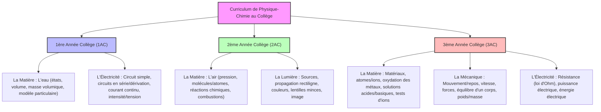

# Guide d'Étude Complet : Compétences Professionnelles (Didactique de la Physique-Chimie)
*Préparation à l'examen de sortie des Centres Régionaux des Métiers de l'Éducation et de la Formation (CRMEF) - Session 2026*

Ce document constitue la synthèse méthodologique et conceptuelle indispensable pour réussir l'épreuve de **Didactique de la spécialité (Physique-Chimie)**, rédigée en français (langue officielle de l'épreuve scientifique).

---

## 📌 1. Les Savoirs Didactiques et Pédagogiques (Théorie)

Ce sont les concepts clés de la didactique des sciences physiques que vous devez savoir définir et illustrer.

### A. La Transposition Didactique
Processus d'adaptation et de simplification du savoir pour le rendre accessible aux élèves.
*   **Savoir savant** (Université/Recherche) $\to$ **Savoir à enseigner** (Programmes et manuels officiels) $\to$ **Savoir enseigné** (Le cours réel de l'enseignant, fiches pédagogiques) $\to$ **Savoir assimilé** (Les acquis réels de l'élève).

### B. Le Contrat Didactique et ses Dérives
Ensemble des règles et attentes réciproques implicites entre l'enseignant et l'élève concernant le savoir.
*   **Effet Topaze** : L'enseignant donne la réponse dans sa question ou simplifie excessivement la tâche, privant l'élève de l'effort d'apprentissage.
*   **Effet Jourdain** : L'enseignant valide une réponse fausse ou banale d'un élève en la faisant passer pour un exploit scientifique.
*   **Glissement métacognitif** : Remplacer l'objet d'apprentissage scientifique par l'apprentissage de l'outil ou du support (ex: passer le cours de physique à apprendre à faire un tableau Excel).

### C. Conceptions (Représentations) et Obstacles
*   **Conceptions** : Théories intuitives ou explications naïves des élèves avant d'avoir reçu le cours (ex : *"le courant électrique s'use dans la lampe"*).
*   **Obstacle** : Blocage intellectuel empêchant l'assimilation du savoir correct.
    *   *Obstacle de la continuité* : Difficulté à admettre le vide entre les molécules.
    *   *Obstacle anthropomorphique* : Attribuer des comportements humains aux molécules (ex: *"les atomes aiment s'associer"*).

---

## 📌 2. Le Curriculum de Physique-Chimie au Collège (Programmes & Prérequis)

Vous devez maîtriser la progression des cours du collège en français (Option Internationale) pour concevoir des fiches ou des évaluations.

*   **Les Prérequis (المكتسبات السابقة)** : Les notions nécessaires pour aborder un nouveau chapitre.
    *   *Exemple* : Pour enseigner *la résistance et la loi d'Ohm* (3AC), les prérequis sont : *le circuit électrique simple (1AC), l'intensité et la tension (1AC), la manipulation de l'ampèremètre et du voltmètre (1AC)*.

---

## 📌 3. Méthodologies d'Enseignement (Les Démarches)

### A. La Démarche d'Investigation (DI)
Démarche scientifique privilégiée pour enseigner les sciences physiques. Ses 7 étapes incontournables :
1.  **Situation de départ** : Phénomène réel, concret, provoquant un questionnement.
2.  **Formulation du problème** : Question scientifique claire posée par les élèves (ex : *"Comment varie la masse lors de la dissolution du sel ?"*).
3.  **Émission des hypothèses** : Réponses provisoires formulées par les élèves.
4.  **Investigation** : Expériences de laboratoire (manipulations), recherches documentaires ou simulations (PhET).
5.  **Partage / Confrontation** : Présentation et confrontation des résultats des groupes.
6.  **Institutionnalisation** : Synthèse rédigée par l'enseignant, écriture des lois physiques ou des formules.
7.  **Réinvestissement** : Exercices d'application directe.

---

## 📌 4. Les Savoir-faire Pratiques pour l'Examen

### A. Rédiger une Fiche Pédagogique (Fiche de préparation / Joudada)
La fiche doit obligatoirement comprendre :
*   **L'en-tête** : Niveau, titre de la leçon, durée, prérequis, objectifs opérationnels (commençant par un verbe d'action : *mesurer, identifier, appliquer, brancher...*), matériel de laboratoire.
*   **Le tableau de déroulement** :
    *   *Étapes de la leçon* (Introduction, Investigation, Synthèse, Évaluation).
    *   *Activités de l'enseignant* (Consignes, questions, guidage).
    *   *Activités des élèves* (Hypothèses, manipulations, schémas, prise de notes).
    *   *Supports didactiques* (Tableau, fiches de TP, matériel de TP, ordinateur).
    *   *Évaluation* (Formative, diagnostique).

### B. L'Évaluation Critériée et l'Analyse des Erreurs
*   **Critères minimaux de correction** :
    *   **Pertinence** : L'élève répond précisément à la consigne sans hors-sujet.
    *   **Utilisation correcte des outils** : Formules physiques correctes, calculs exacts, unités écrites (V, A, W, J, kg...).
    *   **Cohérence** : Démonstration logique et structurée.
*   **Analyse d'erreur** :
    *   *Identifier l'erreur* $\to$ *Déterminer l'origine* (didactique, mathématique, liée à l'obstacle) $\to$ *Proposer une activité de remédiation* (expérience alternative ou exercice ciblé).
