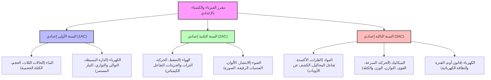

# دليل التركيب والتحضير: المعارف، المكتسبات، والمهارات لاجتياز اختبار الكفايات المهنية
*ديداكتيك الفيزياء والكيمياء بالثانوي الإعدادي - دورة يونيو 2026*

يمثل هذا الدليل الخريطة الذهنية الشاملة التي تجمع كل ما يجب معرفته وفهمه والقدرة على إنتاجه لاجتياز الاختبار بنجاح ونيل نقطة ممتازة.

---

## 📌 أولاً: المعارف الديدكتيكية والبيداغوجية الأساسية (Savoirs)
هي المفاهيم النظرية والنظريات البيداغوجية التي يجب حفظها والقدرة على تعريفها وتوظيفها:

### 1. مفاهيم ديدكتيكية مركزية
*   **النقل الديدكتيكي**: تحويل المعرفة العلمية الأكاديمية الصعبة (سواء من الميكانيك أو الكهرباء) إلى معرفة مبسطة ومناسبة لسن المتعلم ومستواه المعرفي.
*   **التمثلات (Conceptions)**: الأفكار المسبقة والخاطئة علمياً التي يفسر بها المتعلم الظواهر الطبيعية.
*   **العائق الديدكتيكي**: العقبة الذهنية التي تمنع المتعلم من فهم المفهوم العلمي الصحيح، وتنشأ أحياناً بسبب طرائق التدريس الخاطئة.
*   **الصراع المعرفي (Conflit cognitif)**: إحداث خلخلة في عقل المتعلم عبر وضعه أمام ظاهرة تخالف تمثلاته، مما يدفعه إلى البحث وتغيير فكرته.
*   **التعاقد الديدكتيكي**: القواعد والالتزامات المتبادلة والمضمرة بين الأستاذ والتلميذ حول المعرفة.

### 2. المنهجيات والنهوج العلمية
*   **نهج التقصي (Démarche d'investigation)**: تتبع خطواته السبع بدقة (وضعية الانطلاق $\to$ صياغة السؤال $\to$ الفرضيات $\to$ التجريب والبحث $\to$ التقاسم والمناقشة $\to$ المأسسة $\to$ التطبيق).
*   **النهج التجريبي**: المعتمد على فرضية، وتصميم بروتوكول تجريبي لاختبارها، وتحديد المتغيرات (مثال: دراسة العوامل المؤثرة في سرعة تفاعل كيميائي).

### 3. بيداغوجيا التقويم والدعم
*   **تقويم تكويني**: رصد التعثرات بصفة مستمرة وتصحيحها خلال الحصة.
*   **تقويم تشخيصي**: تقييم قبلي لقياس المكتسبات السابقة.
*   **تحليل الأخطاء**: رصد الأخطاء الشائعة (مثل خلط الوحدات، التمثيل الخاطئ للقوى)، وتصنيف مصدرها، واقتراح خطة معالجة (Remédiation).

---

## 📌 ثانياً: المكتسبات والمقررات الدراسية للإعدادي (Prerequisites & Curriculum)
يجب على المترشح ضبط الدروس والوحدات المقررة في الثانوي الإعدادي وكافة قوانينها الفيزيائية والكيميائية لتصميم تمارين أو جذاذات:

*   **المكتسبات السابقة (Prérequis)**: معرفة المكتسبات التي يبنى عليها كل درس جديد (مثال: لحساب الطاقة الكهربائية $E = P \times t$ في 3AC، يجب أن يكون التلميذ مكتسباً للوحدات الزمنية والقدرة وتطبيقات الضرب والقسمة).

---

## 📌 ثالثاً: المهارات العملية المستهدفة بالاختبار (Skills)
وفق جدول التخصيص وتوصيف الامتحان، يجب أن تتدرب على ثلاثة مستويات مهارية:

### 1. مهارة المعرفة والاستحضار (Connaitre) - *20%*
*   القدرة على كتابة تعاريف بيداغوجية دقيقة (ما هو نهج التقصي؟ ما هو التقويم التكويني؟).
*   استحضار قوانين الفيزياء والكمياء والوحدات العالمية.

### 2. مهارة التطبيق وتوظيف المفاهيم (Appliquer) - *50%*
*   **تصميم جذاذة درس**: صياغة الأهداف، المكتسبات، سيناريو الحصة، وتحديد أدوار الأستاذ والتلميذ.
*   **بناء بروتوكول تجريبي**: كتابة قائمة الأجهزة اللازمة لدرس معين ورسم تبيانة التجربة وخطوات إنجازها بسلامة.
*   **صياغة وضعيات تقويمية**: صياغة أسئلة اختبارية تقيس مهارة معينة لدى التلميذ مع وضع سلم تنقيط معقول.

### 3. مهارة الإبداع والإنتاج البيداغوجي (Créer) - *30%*
*   **صياغة وضعية انطلاق مشكلة**: ابتكار سيناريو مثير ومحفز يبدأ به الدرس ويخلق صراعاً معرفياً لدى التلاميذ.
*   **ابتكار تجارب بديلة (تجارب السند/النجدة)**: اقتراح بدائل في حالة غياب الأجهزة المخبرية الرسمية (مثال: استعمال الخل والخميرة لدراسة التفاعل الكيميائي في غياب حمض الكلوريدريك).
*   **بناء خطط دعم ومعالجة**: تصميم أنشطة دعم موجهة ومبتكرة لعلاج تعثر بيداغوجي معقد (مثل عدم فهم تمثيل القوة بمتجهة).
