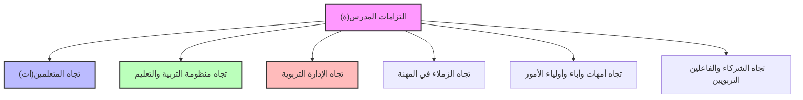

# دليل المراجعة: أخلاقيات المهنة والتشريع التربوي (أخلاقيات المهنة)
*وفق الإطار المرجعي لاختبار سياق ممارسة المهنة - دورة يونيو 2026 (جميع التخصصات)*

يمثل مجال **أخلاقيات المهنة** نسبة **35%** من الوزن الإجمالي للامتحان الكتابي لسياق ممارسة المهنة. يركز هذا المجال على القوانين المنظمة للوظيفة التعليمية، التزامات المدرس تجاه محيطه، والآليات القانونية والحقوقية لتفعيل الأخلاقيات.

---
## 📌 المحور الأول: التزامات وعلاقات المدرس(ة)

تتحدد مسؤوليات الأستاذ(ة) الأخلاقية والقانونية في ستة اتجاهات رئيسية:

1.  **تجاه المتعلمين (الواجب المهني الأساسي)**:
    *   الحرص على التحصيل العلمي الجيد وتكافؤ الفرص وتجنب التمييز.
    *   حماية التلاميذ من العنف اللفظي والجسدي، وضمان سلامتهم الجسدية والمعنوية داخل فضاء الفصل والمؤسسة.
    *   احترام الخصوصية والسر المهني وعدم إفشاء المعطيات الشخصية للتلاميذ.
2.  **تجاه منظومة التربية والتعليم**:
    *   احترام السياسة التعليمية الوطنية وتطبيق التوجهات الرسمية والمناهج.
    *   المساهمة الفعالة في الإصلاح والتطوير المهني المستمر والتكوين الذاتي.
3.  **تجاه الإدارة التربوية**:
    *   احترام التراتبية الإدارية (المدير، المفتش، المدير الإقليمي) والالتزام بالمذكرات والمراسلات الرسمية.
    *   الالتزام بالحضور، وأوقات العمل، وتدوير الوثائق التربوية (دفتر النصوص، لوائح الغياب).
4.  **تجاه زملائه**:
    *   التضامن المهني والتعاون والعمل الجماعي (تبادل الخبرات والموارد التعليمية).
    *   الالتزام بأدب الحوار وتجنب النقد التجريحي أمام المتعلمين أو الإدارة.
5.  **تجاه أمهات وآباء وأولياء الأمور**:
    *   التواصل المستمر وإطلاعهم على نتائج وسلوك أبنائهم بشفافية وموضوعية.
    *   إشراك الأسرة كشريك أساسي في معالجة التعثرات الدراسية أو المشاكل السلوكية.
6.  **تجاه الفاعلين التربويين والشركاء**:
    *   التعاون مع جمعيات المجتمع المدني، جمعية الآباء، والجماعات الترابية لتنشيط الحياة المدرسية.

---

## 📌 المحور الثاني: مبادئ وآليات تفعيل أخلاقيات المهنة

### 1. المبادئ الأخلاقية الموجهة للمهنة
*   **العدالة والإنصاف (Justice et Équité)**: تقييم المتعلمين بموضوعية وتوزيع الاهتمام بالتساوي داخل الفصل.
*   **الاحترام والتقدير (Respect)**: صون كرامة المتعلم وتقدير جهوده.
*   **التواصل الفعال (Communication efficace)**: الاستماع النشط وبناء علاقات ثقة مع كافة المتدخلين.

### 2. آليات تفعيل أخلاقيات مهنة التدريس
*   **الآليات القانونية والإدارية**: القوانين والقرارات الوزارية والمساطر التأديبية (العقوبات الإدارية في حالة الإخلال بالواجب المهني).
*   **الآليات الحقوقية**: المرجعيات الوطنية والدولية لحقوق الإنسان والطفل (مثل الاتفاقية الدولية لحقوق الطفل).
*   **الآليات التربوية**: ميثاق أخلاقيات المهنة بالمؤسسة، النظام الداخلي للمؤسسة، والتعاقد الديدكتيكي والتربوي مع التلاميذ.

---

## 📌 المحور الثالث: المرجعيات التشريعية والقانونية المنظمة للمهنة

يجب على المترشح ضبط النصوص القانونية الكبرى المؤطرة للمنظومة التعليمية بالمغرب:

### 1. القانون الإطار رقم 51.17 (Loi-cadre 51.17)
*   هو بمثابة دستور المنظومة التعليمية، يحدد مبادئ الإصلاح على المدى الطويل. أهم مرئياته: إلزامية التعليم الأولي، تحقيق الإنصاف وتكافؤ الفرص، وتطوير النموذج البيداغوجي لضمان مدرسة الجودة والارتقاء بالفرد والمجتمع.

### 2. القانون رقم 59.21 المتعلق بالتعليم المدرسي (Loi 59.21)
*   يحدد الإطار العام للتعليم المدرسي وهيكلة الأسلاك التعليمية، والزامية التمدرس، وحقوق وواجبات المتعلمين وأسرهم.

### 3. النظام الأساسي الخاص بموظفي وزارة التربية الوطنية (Statut Unifié)
*   يحدد الحقوق (الترقية، التكوين المستمر، الحماية القانونية) والواجبات (الالتزام بأخلاقيات المهنة، إنجاز ساعات العمل الرسمية، المشاركة في مجالس المؤسسة) والمسار المهني وأيضاً **المساطر التأديبية** (العقوبات المقسمة إلى درجات حسب خطورة الخطأ المهني).

---

## 💡 نصائح وحيل للإجابة في الامتحان (Astuces d'examen)

> 
> **كيف تتعامل مع وضعيات الخرق الأخلاقي والقانوني في الامتحان؟**
> 
> *   **حالة الدروس الخصوصية المؤدى عنها**:
>     *   *التأطير القانوني*: يمنع القانون المغربي على أطر التدريس بالقطاع العام إعطاء دروس خصوصية مؤدى عنها لتلاميذهم أو لتلاميذ مؤسسات أخرى خارج الإطار القانوني المرخص له. يُعتبر هذا السلوك إخلالاً بمبدأ الإنصاف وتكافؤ الفرص وخطأً مهنياً يستوجب المتابعة التأديبية.
> 
> *   **حالة الغياب غير المبرر أو رفض تأطير الامتحانات الإشهادية**:
>     *   *التأطير القانوني*: الالتزام بالمشاركة في الحراسة والتصحيح ومجالس المؤسسة واجب مهني رسمي. التغيب غير المبرر عنها يعرض الموظف لاقتطاع الأجر وتوجيه عقوبات تأديبية إدارية (إنذار، توبيخ...).
> 
> *   **العنف الجسدي أو اللفظي ضد المتعلمين**:
>     *   *التأطير القانوني*: خرق سافر لاتفاقية حقوق الطفل وللمذكرات الوزارية الصارمة التي تمنع العقاب البدني والنفسي. يترتب عليه متابعات إدارية وجنائية للأستاذ المتورط.
