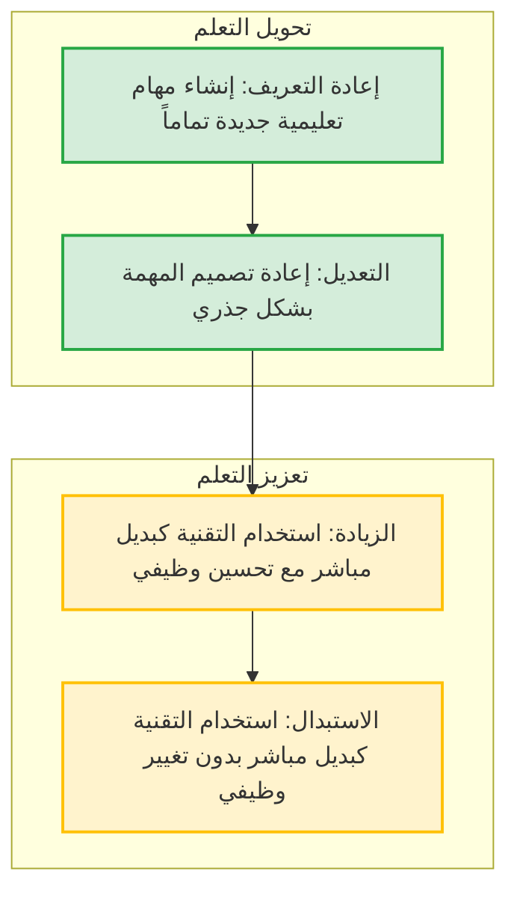
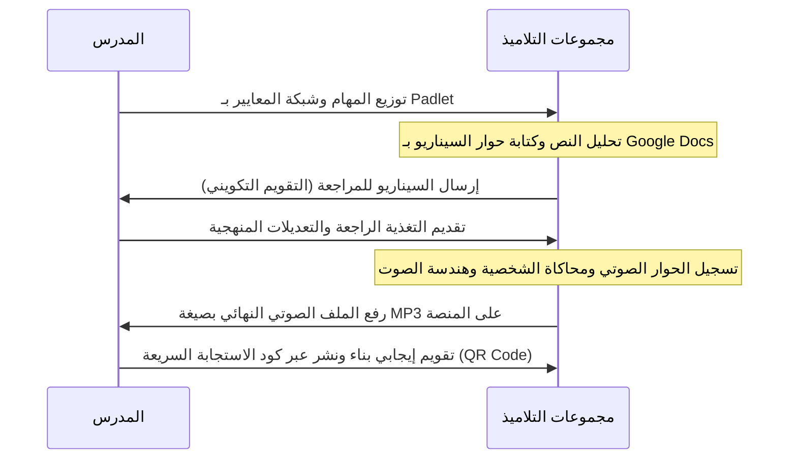

# دليل المراجعة الشامل: مجزوءة TICE (CRMEF 2026)

تم إعداد هذا الدليل لمساعدتكم في الاستعداد للامتحان المقرر في **27 يونيو 2026**. يلخص الدليل المفاهيم الأساسية للمجزوءة باللغة العربية، بما يتوافق مع التوجهات الرسمية لـ CRMEF.

---

## 📅 المحاور الأساسية للمراجعة

### 1. الاستراتيجيات الوطنية والأطر المرجعية
اعتمد المغرب عدة مبادرات استراتيجية لإدماج التكنولوجيا الرقمية في المنظومة التربوية:

*   **برنامج جيني (GENIE) :** أطلق سنة 2006 لتعميم تكنولوجيا المعلومات والاتصالات في التعليم. يرتكز على 4 دعائم أساسية:
    1.  *البنية التحتية:* تجهيز المؤسسات التعليمية بقاعات متعددة الوسائط وربطها بشبكة الإنترنت.
    2.  *تكوين الأساتذة:* تطوير الكفايات التقنية والبيداغوجية للفاعلين التربويين (وفق الإطار المرجعي لليونسكو).
    3.  *الموارد الرقمية:* إنتاج واقتناء موارد رقمية تتلاءم مع المناهج الوطنية.
    4.  *تطوير الاستخدامات:* المرافقة الميدانية لضمان الاستعمال الفعلي للتكنولوجيا في الفصول الدراسية.
*   **الرؤية الاستراتيجية 2015-2030 (CSEFRS) :** حددت هدفين رئيسيين للتعليم الرقمي:
    *   إدماج التكنولوجيا الرقمية بطريقة **مستعرضة** في جميع التخصصات والمواد.
    *   تطوير الثقافة الرقمية وتعميم تدريس علوم الحاسوب والبرمجة (Coding) منذ السلك الابتدائي.
*   **القانون الإطار 51-17 (2019) :** تنص **المادة 33** منه على تطوير موارد ووسائط التدريس، وتعزيز التعليم عن بعد كمعادل ومكمل للتعليم الحضوري، وإحداث مختبرات للابتكار لرفع جودة التعلمات.
*   **النموذج التنموي الجديد (2021) :** أشار إلى أهمية استغلال التكنولوجيا الرقمية وجعلها رافعة للتحول التربوي من خلال تطوير منظومة تكنولوجيا التربية (**EdTech**).
*   **خارطة الطريق 2022-2026 :** يركز **الالتزام السابع** على توفير بيئة عمل ملائمة تستجيب لاحتياجات الأستاذات والأساتذة، وتزويدهم بالموارد الديداكتيكية والرقمية اللازمة.

#### 🌐 المنصات والمواقع الرسمية
*   **[TaalimTICE](https://www.taalimtice.ma) :** البوابة الوطنية للتكنولوجيا الرقمية في التعليم (تضم موارد مصنفة حسب المستويات).
*   **[Massar](https://massar.gov.men.ma) :** منظومة تدبير المتمدرس (تتضمن الأقسام الافتراضية).
*   **E-Takwine (إ-تكوين) :** منصة التكوين المستمر عن بعد للأساتذة والمفتشين.
*   **[TilmidTICE](https://www.tilmidtice.com) / Soutiensco :** منصات موجهة للدعم الدراسي والتعلم الإلكتروني للتلاميذ.
*   **JawazTICE (جواز تيس) :** منصة مخصصة لتعزيز وتصديق الكفاءات الرقمية للمدرسين.

#### 🎓 النماذج النظرية
*   **نموذج تيباك (TPACK) :**
    *   **CK** (*معرفة المحتوى*) : المادة العلمية المراد تدريسها.
    *   **PK** (*المعرفة البيداغوجية*) : طرق وأساليب التدريس والتعلم.
    *   **TK** (*المعرفة التكنولوجية*) : الأدوات والوسائط الرقمية.
    *   *الدمج الفعال* (TPACK) يحدث عند تقاطع هذه المعارف الثلاث؛ أي معرفة المدرس بكيفية استخدام أداة معينة (TK) بطريقة بيداغوجية ملائمة (PK) لتدريس مفهوم علمي محدد (CK).
*   **نموذج رابي (RABY - 2005) :** يوضح مراحل تملك المدرس للتكنولوجيا الرقمية عبر 4 خطوات:
    1.  *التحسيس (Familiarisation) :* مرحلة التعرف الأولي على الأداة مع وجود نوع من التردد.
    2.  *الاستخدام الشخصي :* توظيف التكنولوجيا للحاجيات الخاصة (البحث، الإدارة الشخصية).
    3.  *الاستخدام المهني :* إعداد الدروس، التواصل مع الزملاء والإدارة.
    4.  *الاستخدام البيداغوجي (Appropriation) :* إدماج التكنولوجيا مباشرة لخدمة تعلم التلاميذ وجعلهم فاعلين.

> [!NOTE]
> **النيتيكيت (Netiquette - آداب السلوك الرقمي):** هي القواعد الأخلاقية والسلوكية للتواصل المحترم والمسؤول عبر الإنترنت. تشمل احترام الآخرين، حماية المعطيات الشخصية، الالتزام بالوقت في الحصص الافتراضية، وتجنب تسجيل أو تصوير المشاركين دون إذن مسبق.

---

### 2. الموارد الرقمية والموارد المفتوحة (REN & REL)

#### 🔍 تقييم ومصداقية المورد الرقمي
قبل استخدام المورد الرقمي في الفصل، يجب إخضاعه للتقييم بناءً على:
*   **المصدر والمؤلف :** هل الجهة الناشرة موثوقة (موقع رسمي حكومي .ma، جامعي .edu، أم مدونة شخصية غير مراجعة)؟
*   **التحيين والملاءمة :** هل المورد محدث وتاريخ نشره قريب؟ هل يتناسب مع المنهاج الدراسي المغربي؟
*   **الموضوعية والدقة :** خلو المورد من الأخطاء العلمية أو اللغوية، وتجنب الانحياز التجاري أو الأيديولوجي.

#### 🔓 المميزات الخمس للموارد التعليمية المفتوحة (REL - إطار 5R لـ David Wiley)
الموارد المفتوحة هي مواد تعليمية منشورة بموجب ترخيص يسمح للآخرين بـ:
1.  **الاحتفاظ (Retain) :** تنزيل المورد وحفظه وامتلاك نسخة منه بشكل دائم.
2.  **إعادة الاستعمال (Reuse) :** استخدام المورد في سياقات مختلفة (داخل الفصل، موقع تعليمي).
3.  **المراجعة (Revise) :** تعديل المورد، ترجمته، أو تكييفه ليناسب فئة معينة.
4.  **المزج (Remix) :** دمج المورد مع موارد أخرى لإنتاج محتوى تعليمي جديد.
5.  **إعادة التوزيع (Redistribute) :** مشاركة المورد الأصلي أو المعدل مع الآخرين.

#### 📄 رخص المشاع الإبداعي (Creative Commons - CC)
تسمح للمؤلفين بتحديد شروط واضحة لاستخدام أعمالهم عبر دمج 4 شروط أساسية:

| الرمز | الشرط | المعنى |
| :---: | :--- | :--- |
| **BY** | **نسب المصنف (Attribution)** | وجوب ذكر اسم المؤلف الأصلي ونسب العمل إليه. (موجود في كل الرخص). |
| **NC** | **غير تجاري (Non-Commercial)** | يمنع استخدام العمل لأغراض تجارية أو ربحية. |
| **ND** | **منع الاشتقاق (No Derivatives)** | يمنع تعديل العمل أو اشتقاق أعمال أخرى منه. |
| **SA** | **الترخيص بالمثل (Share Alike)** | يلزم بنشر العمل المشتق تحت نفس الرخصة الأصلية للعمل الأم. |

---

### 3. التدريس والتربية الدامجة بالوسائط الرقمية

#### 🤝 التربية الدامجة والفوارق الفردية
تعتبر التكنولوجيا الرقمية وسيلة ممتازة لتحقيق تكافؤ الفرص لفائدة التلاميذ ذوي الاحتياجات الخاصة:
*   **اضطرابات التعلم (الدسلكسيا، الدسبراكسيا...) :** توظيف خطوط مناسبة (OpenDyslexic)، القراءة الصوتية للنصوص (Synthèse vocale)، والخرائط الذهنية الرقمية.
*   **الإعاقة البصرية :** قارئات الشاشة (NVDA، Jaws)، تكبير الخطوط، وإضافة الوصف النصي للصور (Alt-text).
*   **الإعاقة السمعية :** توفير الترجمة المكتوبة (Sous-titres) على مقاطع الفيديو، والاعتماد على الرسوم التوضيحية البيانية.
*   **تفريد التعلم :** استخدام تطبيقات تفاعلية ذاتية التصحيح (مثل LearningApps أو H5P) تسمح لكل تلميذ بالتعلم حسب إيقاعه الخاص.

#### 📐 السيناريو البيداغوجي (نموذج ADDIE)
لإعداد درس يدمج التكنولوجيا الرقمية، نتبع مراحل الهندسة البيداغوجية الخمس:
1.  **A (التحليل - Analysis) :** تحديد خصائص التلاميذ، الأهداف التعليمية، والعوائق الممكنة.
2.  **D (التصميم - Design) :** تخطيط الأنشطة وتحديد الوسائل الرقمية والوسائط الملائمة.
3.  **D (الإعداد - Development) :** إنتاج أو تجميع الموارد الرقمية (نصوص، صوتيات، اختبارات تفاعلية).
4.  **I (الإنجاز - Implementation) :** تطبيق السناريو داخل الفصل الدراسي (حضوريا أو عن بعد).
5.  **E (التقويم - Evaluation) :** قياس مدى تحقق الأهداف التعليمية وتطوير السيناريو مستقبلاً.

---

### 4. الولوجية الرقمية (Accessibility)
تعني تصميم المواقع والموارد الرقمية بحيث تكون سهلة الاستخدام من طرف الجميع، بمن فيهم الأشخاص ذوي الإعاقة.

> [!IMPORTANT]
> المبادئ الأربعة للولوجية الرقمية وفقاً للتوجيهات الدولية (**WCAG**):
> 1. **قابلية الإدراك (Perceptible) :** تقديم المعلومات بشكل يمكن إدراكه بالحواس (مثل البديل النصي للصور).
> 2. **قابلية التشغيل (Utilisable) :** إمكانية تشغيل وتصفح المحتوى بسهولة (مثل التنقل بالكامل باستخدام لوحة المفاتيح).
> 3. **قابلية الفهم (Compréhensible) :** وضوح اللغة وبساطة تشغيل الواجهات وتوقع سلوك الأزرار.
> 4. **المتانة والصلابة (Robust) :** ملاءمة المحتوى للعمل مع البرمجيات المساعدة الحالية والمستقبلية.

---

### 5. الذكاء الاصطناعي التوليدي (GenAI)

#### 🤖 الاستخدام المسؤول في التعليم
يوفر الذكاء الاصطناعي التوليدي (مثل ChatGPT وGemini) إمكانات هائلة للمدرس:
*   *التخطيط والتحضير :* اقتراح أفكار للأنشطة، توليد نصوص تدريبية، وتصميم شبكات التقييم.
*   *التمايز البيداغوجي :* تبسيط النصوص المعقدة لتناسب مستويات التلاميذ المتعثرين.

ومع ذلك، يجب مراعاة الجوانب التالية لضمان استعمال مسؤول:
*   **التحقق من صحة المضامين :** يعاني الذكاء الاصطناعي من ظاهرة **الهلوسة (Hallucinations)** (تقديم معلومات خاطئة تماماً بأسلوب مقنع). يجب على المدرس مراجعة وتدقيق كل المخرجات.
*   **خصوصية البيانات :** عدم مشاركة معلومات شخصية أو سرية تخص التلاميذ مع نماذج الذكاء الاصطناعي.

#### ✍️ هندسة الأوامر (Prompting)
للحصول على إجابات دقيقة من الذكاء الاصطناعي، يجب صياغة الأوامر بدقة:

##### طريقة RTF (Role, Task, Format)
1.  **Role (الدور) :** تحديد صفة وخبرة الذكاء الاصطناعي. *(مثال: "أنت أستاذ لمادة اللغة العربية بالسلك الثانوي بالمغرب...")*
2.  **Task (المهمة) :** تحديد العمل المطلوب بدقة. *(مثال: "أنتج نصاً قصيراً يتضمن أسماء التفضيل...")*
3.  **Format (القالب/الشكل) :** تحديد شكل المخرج. *(مثال: "اعرض النتيجة في جدول يتضمن الكلمة، وزنها، وفعلها...")*

##### طريقة CREATE
*   **C (الشخصية - Character) :** تحديد شخصية المساعد الذكي.
*   **R (الطلب - Request) :** صياغة السؤال أو المهمة الأساسية بشكل مباشر.
*   **E (أمثلة - Examples) :** تزويد الذكاء الاصطناعي بنماذج مشابهة للنتيجة المرغوبة.
*   **A (التعديلات - Adjustments) :** وضع قيود (عدد الكلمات، النبرة، الفئة المستهدفة).
*   **T (نوع المخرجات - Types of output) :** تحديد الصيغة النهائية (نص، جدول، خريطة ذهنية).
*   **E (التقييم - Evaluation) :** مطالبة النموذج بمراجعة إجابته أو توضيح خطواته.

---

## 📝 أسئلة متعددة الاختيارات للتدريب (QCM)

*تنبيه: يمكن أن تتضمن الأسئلة **إجابة صحيحة واحدة أو أكثر**.*

#### س1. يرتكز برنامج "جيني" (GENIE) لتعميم التكنولوجيا بالمنظومة التعليمية بالمغرب على: (اختر كل الإجابات الصحيحة)
- [ ] أ. توظيف أساتذة متخصصين حصرياً في الإعلاميات.
- [ ] ب. توفير وتطوير الموارد الرقمية التربوية الملائمة.
- [ ] ج. تكوين المدرسين وتطوير كفاياتهم المهنية في استخدام TICE.
- [ ] د. تجهيز المؤسسات بالبنية التحتية والربط بالإنترنت.

💡 التصحيح والتعليل

**الإجابات الصحيحة: ب، ج، د.**
يرتكز برنامج جيني على أربع دعائم أساسية: البنية التحتية وتجهيز المدارس (د)، تكوين الأساتذة (ج)، تطوير الموارد الرقمية (ب)، بالإضافة إلى تطوير وتعميم الاستخدامات. بينما توظيف أساتذة الإعلاميات ليس من ركائزه الأساسية لتنفيذ خطة إدماج TICE في سائر المواد.

#### س2. يتألف نموذج "تيباك" (TPACK) من تقاطع المعارف التالية: (اختر كل الإجابات الصحيحة)
- [ ] أ. المعرفة بالمحتوى والمادة الدراسية (CK).
- [ ] ب. المعرفة البيداغوجية وطرق التدريس (PK).
- [ ] ج. المعرفة التكنولوجية والوسائط الرقمية (TK).
- [ ] د. المعرفة النفسية للمتعلم (Psychological Knowledge).

💡 التصحيح والتعليل

**الإجابات الصحيحة: أ، ب، ج.**
نموذج TPACK هو اختصار لـ Technological Pedagogical Content Knowledge، ويركز على التكامل بين المعرفة التكنولوجية والمنهجية البيداغوجية والمادة العلمية (المحتوى).

#### س3. رخصة المشاع الإبداعي التي تحمل الرمز `CC BY-NC-ND` تعني: (اختر الإجابة الصحيحة)
- [ ] أ. إمكانية تعديل العمل واستخدامه تجارياً بشرط ذكر المؤلف.
- [ ] ب. وجوب نسب العمل للمؤلف، ومنع استخدامه تجارياً، ومنع تعديله أو اشتقاقه.
- [ ] ج. الترخيص باستخدام العمل تجارياً ونشره تحت نفس الرخصة.
- [ ] د. حرية كاملة في التصرف في المصنف دون قيود.

💡 التصحيح والتعليل

**الإجابة الصحيحة: ب.**
*   `BY` تعني نسب المصنف للمؤلف الأصلي.
*   `NC` (Non-Commercial) تعني منع الاستخدام التجاري.
*   `ND` (No Derivatives) تعني منع التعديل أو الاشتقاق. وبالتالي، تعتبر هذه الرخصة الأكثر تقييداً من بين رخص المشاع الإبداعي.

#### س4. وفقاً للمبادئ الخمسة للموارد التعليمية المفتوحة (REL)، تتيح ميزة "المزج" (Remix): (اختر الإجابة الصحيحة)
- [ ] أ. تنزيل الموارد وحفظ نسخ منها في الحاسوب.
- [ ] ب. ترجمة وتعديل المورد الأصلي ليلائم بيئة جديدة.
- [ ] ج. دمج موردين مفتوحين أو أكثر لإنشاء محتوى تعليمي جديد.
- [ ] د. مشاركة المورد الأصلي مع الزملاء عبر البريد الإلكتروني.

💡 التصحيح والتعليل

**الإجابة الصحيحة: ج.**
المزج (Remix) هو عملية تجميع ومزج محتويات مختلفة من مصادر تعليمية مفتوحة لإنشاء مورد جديد، بينما الحفظ يسمى (الاحتفاظ Retain) والتعديل الفردي يسمى (المراجعة Revise) والمشاركة تسمى (إعادة التوزيع Redistribute).

---

## 🧩 وضعية تقويمية تطبيقية (SAMR + نشاط ديداكتيكي)

### 📌 نص الوضعية
> **السياق :** في إطار درس مكون النصوص بسلك الثانوي التأهيلي (الجذع المشترك)، يرغب أستاذ اللغة العربية في جعل تلاميذه يشتغلون على موضوع "الوصف الشخصي (ال portrait) وبنية الشخصيات" في رواية أو نص قصصي مقرر. في الممارسة التقليدية، كان النشاط يقتصر على قراءة النص، واستخراج الصفات المادية والمعنوية للشخصية وتدوينها في جدول على الدفاتر، ثم كتابة خلاصة تركيبية فردية.
>
> **المطلوب :** صغ إجابة مهيكلة في قسمين:
> 1.  تحليل لتطوير هذا النشاط التقليدي وإدماج التكنولوجيا فيه تدريجياً وفق مستويات نموذج **سامر (SAMR)** الأربعة.
> 2.  تخطيط لنشاط TICE مدمج ومبتكر في الفصل الدراسي (تحديد: الهدف، الأداة الرقمية، الأدوار، ومستوى سامر المستهدف).

---

### 🔑 مقترح الإجابة النموذجية (مثالي للامتحان المهني والمراكز)

#### القسم الأول: تحليل النشاط وفق نموذج سامر (SAMR)

يصنف نموذج **سامر (SAMR)** درجة إدماج التقنية في الفصل إلى أربعة مستويات تنتقل من مرحلة تحسين العمل التقليدي إلى تحويله بشكل جذري.

1.  **الاستبدال (Substitution) :**
    *   *الممارسة المقترحة:* يقرأ التلاميذ النص في صيغة إلكترونية (PDF) على شاشات الهواتف أو الحواسب، ويقومون بتدوين جدول الصفات المادية والمعنوية للشخصية باستعمال معالج النصوص (Microsoft Word أو Google Docs) بدلاً من الورقة والقلم.
    *   *التحليل:* هنا تم استبدال الوسيط الورقي بالرقمي مباشرة، دون أي تغيير وظيفي في طبيعة المهمة التعليمية (الاستخراج والكتابة بقيا كما هما).
2.  **الزيادة (Augmentation) :**
    *   *الممارسة المقترحة:* يقوم التلاميذ أثناء تعبئة الجدول على معالج النصوص باستخدام مصحح الأخطاء التلقائي، والروابط التشعبية للوصول إلى معاجم لغوية لشرح الكلمات الصعبة، واستعمال ميزة البحث الفوري عن مرادفات الصفات المعنوية.
    *   *التحليل:* أضافت التكنولوجيا قيمة جديدة وسهلت إنجاز المهمة بفعالية، وزادت من استقلالية المتعلم في البحث، مما يمثل تحسيناً وظيفياً.
3.  **التعديل (Modification) :**
    *   *الممارسة المقترحة:* يشتغل التلاميذ في مجموعات صغيرة (3 تلاميذ) على مستند تشاركي واحد متزامن (Google Docs أو Padlet). يوزعون الأدوار بينهم لاستخراج صفات شخصيات مختلفة في نفس الوقت، ويتناقشون عبر التعليقات لكتابة الخلاصة التركيبية وإدراج صور توضيحية لملامح وملابس الشخصية التاريخية أو الروائية.
    *   *التحليل:* سمحت التقنية بإعادة تصميم المهمة؛ حيث تحول العمل من نشاط فردي معزول إلى نشاط تعاوني تشاركي متعدد الوسائط، وهو أمر يصعب تحقيقه بذات الفعالية ورقياً.
4.  **إعادة التعريف (Redefinition) :**
    *   *الممارسة المقترحة:* يُطلب من التلاميذ تحويل النص السردي والوصف المستخرج إلى **شريط مصور تفاعلي أو قصة مصورة رقمية (Digital Comic)** باستخدام تطبيقات مثل (Pixton أو Canva)، أو تسجيل **بودكاست (Podcast)** يلعب فيه تلميذ دور مذيع يستجوب الشخصية الروائية لتكشف عن صفاتها وصراعاتها النفسية، ثم نشر المخرج النهائي في البوابة الإلكترونية للمؤسسة.
    *   *التحليل:* تم خلق مهمة تعليمية جديدة كلياً تتميز بالإبداع والإنتاج المعرفي والمحاكاة، وهو ما كان مستحيلاً في غياب التكنولوجيا الرقمية.

---

#### القسم الثاني: بطاقة تقنية للنشاط المدمج المقترح

*   **عنوان النشاط :** *بودكاست الشخصيات الروائية*
*   **المستوى الدراسي المستهدف :** الجذع المشترك الأدبي / العلمي.
*   **الهدف التعلمي :** صياغة وإنتاج وصف شخصية روائية شفهياً باعتماد تقنية المحاكاة ولعب الأدوار (تطوير كفايتي التعبير والكتابة الشفهية).
*   **الأداة الرقمية المستعملة :**
    *   جدار رقمي تشاركي (Padlet) للتخطيط وجمع النصوص المساعدة والسيناريوهات.
    *   الهواتف الذكية للتلاميذ لتسجيل الصوت + تطبيق مونتاج صوتي مجاني بسيط (Audacity أو تطبيق تسجيل الهاتف).
*   **مستوى نموذج سامر (SAMR) المستهدف :** **إعادة التعريف (Redefinition)**.
*   **توزيع الأدوار وسيرورة العمل :**

##### دور الأستاذ :
1.  *التوجيه والتأطير :* توفير بيئة العمل الرقمية وتحديد الأهداف بوضوح وتوضيح شبكة التقويم.
2.  *المتابعة والتغذية الراجعة :* مراجعة السيناريوهات المكتوبة وتصحيحها لغوياً وبلاغياً قبل مرحلة التسجيل الصوتي.
3.  *التقويم والدعم :* تقويم الأداء الصوتي والتعبير الإبداعي للتلاميذ ونشر الأعمال المتميزة للرفع من دافعيتهم.

##### دور التلاميذ :
1.  *التخطيط والتحليل :* قراءة النص قراءة نقدية لاستخراج وتصنيف المؤشرات الوصفية للشخصية وتوظيفها لكتابة سيناريو الحوار.
2.  *الإنتاج التقني والفني :* توزيع الأدوار داخل المجموعة (مستجوب، شخصية روائية، مهندس صوت)، والتمرن على الإلقاء، وإجراء التسجيل الصوتي وإضافة مؤثرات صوتية بسيطة.
3.  *تقويم النظراء :* الاستماع إلى إنتاجات المجموعات الأخرى وإبداء ملاحظات بناءة حولها.

---

> [!TIP]
> **نصائح للنجاح في الامتحان غداً:**
> *   استعمل مصطلحات البيداغوجيا الحديثة باللغة العربية مثل: *التكامل التكنولوجي البيداغوجي، التقويم التكويني، التغذية الراجعة، تفريد التعلم، التربية الدامجة، الموارد الرقمية المفتوحة*.
> *   عند إجابتك عن وضعية مشكلة، احرص على تبيان **القيمة المضافة** لإدماج التكنولوجيا على مستوى جودة التحصيل المعرفي للتلميذ.

بالتوفيق والنجاح في امتحانكم غداً! 🚀
