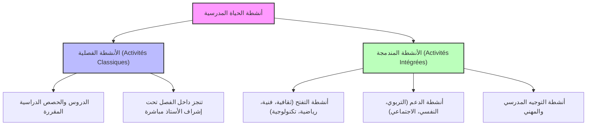

# دليل المراجعة: الحياة المدرسية (الحياة المدرسية: مجالاتها وآليات تفعيلها)
*وفق الإطار المرجعي لاختبار سياق ممارسة المهنة - دورة يونيو 2026 (جميع التخصصات)*

يمثل مجال **الحياة المدرسية** نسبة **35%** من الوزن الإجمالي للامتحان الكتابي لسياق ممارسة المهنة. ينقسم هذا المجال إلى محاور رئيسية تشمل مجالات الحياة المدرسية، أنشطة وآليات تفعيلها (المجالس، المشاريع، والأندية التربوية).

---

## 📌 المحور الأول: مجالات الحياة المدرسية
*Domaines de la vie scolaire*

تهدف الحياة المدرسية إلى تنشئة متعلم متوازن، مبدع، وواعٍ بحقوقه وواجباته من خلال ثلاثة مجالات كبرى:

1.  **المواطنة والعيش المشترك (Citoyenneté et Vivre-ensemble)**:
    *   ترسيخ قيم الديمقراطية، حقوق الإنسان، والتسامح.
    *   نشر ثقافة الحوار وقبول الاختلاف والحد من السلوكات العنيفة (عبر خلايا الإنصات والوساطة التربوية).
2.  **الصحة المدرسية والأمن الإنساني (Santé scolaire et Sécurité humaine)**:
    *   التحسيس بأهمية التغذية المتوازنة ومحاربة الإدمان والآفات الصحية.
    *   تأمين الفضاء المدرسي مادياً ومعنوياً، وتوفير شروط الوقاية من الحوادث المدرسية.
3.  **البيئة والتنمية المستدامة (Environnement et Développement durable)**:
    *   المحافظة على الموارد الطبيعية (الماء، الطاقة) داخل وخارج المؤسسة.
    *   التحسيس بالتغيرات المناخية وتدوير النفايات وتزيين وتخضير فضاءات المؤسسة.

---

## 📌 المحور الثاني: أنشطة الحياة المدرسية وتصنيفاتها
*Typologie des activités de la vie scolaire*

تنقسم الأنشطة داخل المؤسسة إلى قسمين رئيسيين:

*   **أنشطة المهارات الحياتية (Life Skills)**: أنشطة تهدف لتطوير القدرات الشخصية والعلائقية للمتعلم (التواصل، التفكير النقدي، حل المشكلات، اتخاذ القرار، العمل في فريق).
*   **التثقيف بالنظير (Éducation par les pairs)**: مقاربة تربوية يقوم فيها متعلمون مؤهلون (سفراء أو قادة) بتثقيف وتحسيس زملائهم من نفس السن حول قضايا معينة (الصحة، العنف الرقمي، التدخين).

---

## 📌 المحور الثالث: آليات تفعيل الحياة المدرسية
*Mécanismes d'activation de la vie scolaire*

تتفعل الحياة المدرسية بصفة مؤسساتية عبر ثلاثة روافد أساسية: المجالس، المشاريع، والأندية التربوية.

### 1. مجالس المؤسسة (Organes de Gouvernance) - *بالغة الأهمية للامتحان*
تتكون بنية التدبير الجماعي بالمؤسسة من أربعة مجالس يترأسها مدير المؤسسة:

*   **مجلس التدبير (Conseil de Gestion)**:
    *   *مهامه*: الصلاحيات الإدارية والمالية. يدرس ويصادق على مشروع المؤسسة المندمج (PEI)، يحدد برنامج العمل السنوي للمؤسسة، يبدي رأيه في اتفاقيات الشراكة، ويصادق على ميزانية المؤسسة (جمعية دعم مدرسة النجاح).
*   **المجلس التربوي (Conseil Pédagogique)**:
    *   *مهامه*: الصلاحيات البيداغوجية والثقافية. يضع مشاريع الأنشطة الداعمة والمندمجة، ينسق بين مختلف النوادي التربوية، يقترح تدابير الدعم التربوي ومحاربة الهدر المدرسي.
*   **مجالس التعليم (Conseils d'Enseignement)**:
    *   *مهامها*: تجمع أساتذة المادة الواحدة. تدرس المناهج والكتب المدرسية المقررة، تنسق توزيع الدروس والفرائض (الفروض) وطرق التقويم، وتحدد الحاجيات من الوسائل الديدكتيكية والتجهيزات المخبرية.
*   **مجالس الأقسام (Conseils de Classes)**:
    *   *مهامها*: تعقد نهاية كل دورة. تدرس نتائج التلاميذ وتقوم بتوجيههم، وتبت في طلبات الاستعطاف (إعادة التمدرس)، وتتخذ العقوبات التأديبية في حق التلاميذ المخالفين للنظام الداخلي.

### 2. تدبير المشاريع التربوية (Gestion des Projets)
*   **مشروع المؤسسة المندمج (PEI - Projet d'Établissement Intégré)**: الإطار المنهجي المعتمد رسمياً لقيادة التغيير وتجويد التعلمات بالمنهجية التشاركية (يغطي عادة 3 سنوات).
*   **مشروع القسم (Projet de classe)**: مشروع ينجزه الأستاذ مع تلاميذ فصل معين لتحقيق أهداف تعليمية مندمجة (أبحاث، مجلة حائطية).
*   **المشروع الشخصي للمتعلم (Projet personnel de l'élève)**: خطة رسمية يضعها المتعلم بمساعدة أسرته والموجه لمساره الدراسي والمهني.

### 3. الأندية التربوية (Clubs Scolaires)
*   هي فضاءات يشارك فيها المتعلمون اختيارياً لتطوير مواهبهم وتفعيل الأنشطة المندمجة.
*   *الهيكلة*: يترأس النادي تلميذ(ة) منتخب، ويقوم أستاذ(ة) أو أكثر بدور المؤطر والمنشط.

---

## 💡 نصائح وحيل للإجابة في الامتحان (Astuces d'examen)

> [!IMPORTANT]
> **السيناريوهات المتكررة في الامتحانات وطريقة معالجتها:**
> 
> *   **السيناريو 1: تفشي سلوك العنف أو التخريب داخل المؤسسة**
>     *   *الجواب البيداغوجي*: تفعيل **المجلس التربوي** لوضع خطة مستعجلة، تنشيط **نادي المواطنة وحقوق الإنسان** لتنظيم ورشات تحسيسية حول العيش المشترك، تفعيل **خلايا الإنصات والوساطة**، وإشراك **جمعية أمهات وآباء وأولياء التلاميذ** كشريك خارجي.
> 
> *   **السيناريو 2: تصميم مشروع نادٍ تربوي (طلب كتابة بطاقة تقنية لإنشاء نادي)**
>     *   يجب أن تتضمن البطاقة التقنية: 
>         1.  *اسم النادي* والجهة المستهدفة.
>         2.  *الأهداف* (معرفية، وجدانية، حس-حركية).
>         3.  *برنامج العمل السنوي* (أنشطة، معارض، زيارات ميدانية).
>         4.  *الموارد البشرية والمادية* (الأساتذة المؤطرين، قاعات المؤسسة، ميزانية جمعية دعم مدرسة النجاح).
>         5.  *مؤشرات التقييم* (نسبة انخراط التلاميذ، أثر الأنشطة على السلوك والتعلمات).
